# Renewable Energy Systems (OEE351)

> **Note:** Diagrams might be incorrect. Please check them yourself.

  

# 🌱 **UNIT I – INTRODUCTION**

## 🔹 1. **Primary Energy Sources**

**Definition:**
Primary energy sources are **natural sources of energy** that are **used directly without any conversion**.

**Types of Primary Energy Sources:**

* **Renewable:** Naturally replenished

  * Examples: 🌞 Sunlight, 💨 Wind, 💧Water, 🌾 Biomass, 🌍 Geothermal
* **Non-Renewable:** Limited supply, cannot be replaced quickly

  * Examples: 🛢️ Petroleum, ⛏️ Coal, 🔥 Natural Gas, ☢️ Nuclear

📌 **diagram: true**
**Google search:** `types of energy sources chart`

---

## 🔹 2. **Renewable vs. Non-Renewable Energy Sources**

| Feature                  | Renewable Energy 🌱         | Non-Renewable Energy 🔥 |
| ------------------------ | --------------------------- | ----------------------- |
| **Source**               | Nature (unlimited)          | Earth’s crust (limited) |
| **Availability**         | Continuous, infinite        | Can be exhausted        |
| **Environmental Impact** | Very low pollution          | High carbon emissions   |
| **Examples**             | Solar, Wind, Biomass, Hydro | Coal, Oil, Natural Gas  |
| **Sustainability**       | Long-term safe              | Not sustainable         |

📌 **diagram: true**
**Google search:** `renewable vs nonrenewable venn diagram`

✅ This comparison is often asked in 2, 5, or 13 mark questions.

---

## 🔹 3. **Renewable Energy Resources in India**

India has a **huge diversity of renewable resources**, thanks to its geography and climate.

### 🔸 Major Renewable Sources by Region:

| Resource       | Key States/Regions                        |
| -------------- | ----------------------------------------- |
| **Solar**      | Rajasthan, Gujarat, Tamil Nadu, Telangana |
| **Wind**       | Tamil Nadu, Maharashtra, Karnataka        |
| **Hydro**      | Himachal Pradesh, Uttarakhand             |
| **Biomass**    | Punjab, Haryana, West Bengal              |
| **Geothermal** | Limited (Ladakh, Gujarat)                 |

📌 **diagram: true**
**Google search:** `renewable energy in india map`

---

## 🔹 4. **Current Usage of Renewable Energy in India**

India is a **global leader in renewable energy adoption**.

### 🔸 Current Installed Capacity (as of 2024):

| Energy Source | Capacity (GW) |
| ------------- | ------------- |
| Solar         | 81            |
| Wind          | 46            |
| Bio Power     | 10            |
| Hydro         | 5             |
| **Total**     | **\~145+ GW** |

💡 India gets **\~40%** of its power from **non-fossil fuel sources**.

✅ This topic is usually asked as:

> *“Write a short note on the present status of renewable energy in India.”*

---

## 🔹 5. **Future Potential of Renewable Energy & Tech Development**

### 🔸 Why Future = Renewable?

* 🔋 Fossil fuels are **depleting**
* 🌍 Need to reduce **carbon emissions**
* 🔧 Tech is **improving** fast
* 🇮🇳 India has **huge solar & wind potential**

### 🔸 Estimated Potential in India:

| Source         | Potential (GW) |
| -------------- | -------------- |
| Solar          | 750            |
| Wind (onshore) | 300            |
| Biomass        | 30             |
| Small Hydro    | 20             |

📌 **diagram: true**
**Google search:** `india renewable energy potential graph`

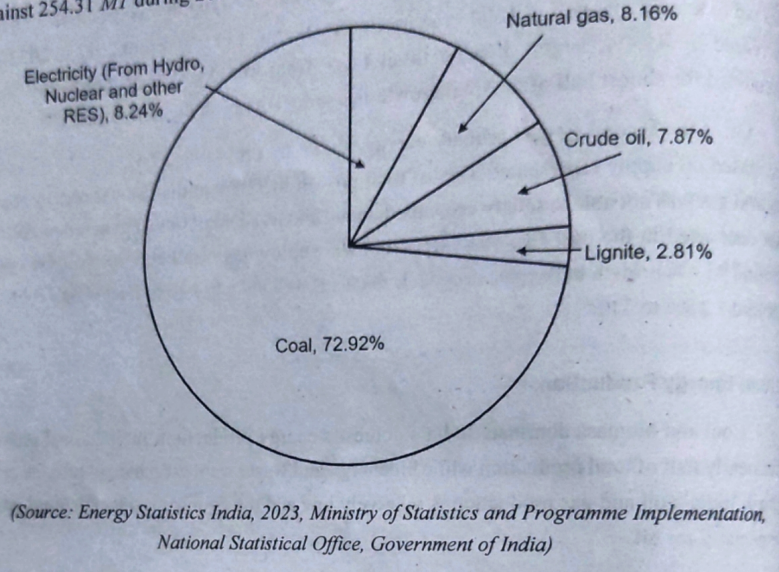
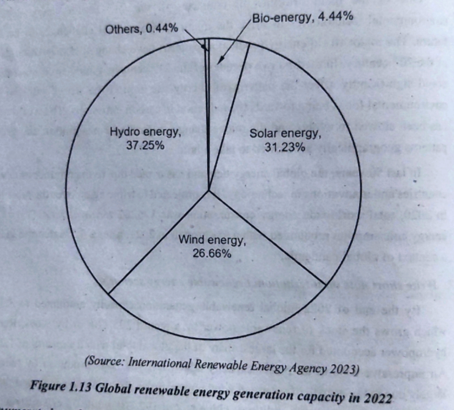

---

### 🔧 Development of Renewable Energy Technologies

**Recent Advancements:**

* **Floating Solar Panels** – Installed on lakes/dams 💧
* **Perovskite Solar Cells** – More efficient solar tech ⚡
* **Offshore Wind Farms** – Wind turbines at sea 🌊
* **Smart Grids** – Real-time power management 🧠⚡
* **Hybrid Systems** – Solar + Wind + Battery combos 🔄

**India’s Future Targets:**

* 500 GW from renewables by 2030
* 100% clean energy transition by 2070
* Promote **Green Hydrogen**, **EVs**, and **Energy Storage**

**Government Initiatives:**

* International Solar Alliance (ISA)
* PLI scheme for solar module manufacturing
* KUSUM scheme for solar pumps

---

## ✍️ ✨ **Sample 13-Mark Answer** ✨

> Primary energy sources are the natural sources of energy used in raw form. They are classified into renewable (solar, wind, hydro) and non-renewable (coal, oil, gas). Renewable energy is eco-friendly, infinite, and essential for sustainable development, unlike fossil fuels which are polluting and depleting.
>
> India is rich in renewables, with solar energy in states like Rajasthan and Gujarat, wind energy in Tamil Nadu and Maharashtra, and biomass in Punjab and West Bengal. As of 2024, the total installed renewable energy capacity in India is around 145 GW, with solar leading the chart.
>
> Looking ahead, India targets 500 GW from non-fossil sources by 2030. The government is supporting innovations like floating solar, offshore wind, smart grids, and hybrid energy systems.
>
> With such vast resources and strong policy support, renewable energy is not only vital for India’s sustainable future but also a major driver for economic and technological growth.

---

  

## 🟨 UNIT II – SOLAR ENERGY

**13-Mark Answer | Subject: Renewable Energy Systems (OEE351)**
**Style: Exam-ready | Easy language | Diagrams at right spots**

---

### 🔶 Solar Radiation and Its Measurement

* **Solar radiation** = Sun’s energy that reaches Earth. It includes:

  * **Direct radiation** ☀️ (straight from sun)
  * **Diffuse radiation** ☁️ (scattered in the atmosphere)
  * **Global radiation** = Direct + Diffuse

#### 📏 Measurement Instruments:

* **Pyranometer** – measures global radiation
* **Pyrheliometer** – measures direct radiation
* **Sunshine Recorder** – measures sunshine duration
* **Solarimeter** – measures total solar energy received

🔍 `diagram: true`
**Google Search**: "Solar radiation measurement instruments diagram"

Pyreliometer

pyranometer
---

### 🔶 Solar Thermal Energy Conversion from Flat Plate Collectors (FPC)

* Converts sunlight into **heat energy**
* Used for water heating, drying, etc.
* **Flat Plate Collector (FPC):**

  * Simple, fixed device
  * Has absorber plate, glass cover, insulation, and casing
  * Heat transfer fluid flows in copper tubes

#### 🔥 Working:

1. Sun hits the absorber plate
2. Heat is transferred to fluid (like water or glycol)
3. Hot fluid is stored or used

🔍 `diagram: true`
**Google Search**: "Flat Plate Solar Collector working diagram"
.png)

---

### 🔶 Concentrating Collectors and Their Types

* These **focus sunlight** onto a small area to get higher temperatures
* Used in solar cookers, power plants, industrial heating

#### Types of Concentrating Collectors:

1. **Parabolic Trough Collector (PTC)** – curved mirror, focuses sun on tube
2. **Paraboloid Dish Collector** – focuses on one point
3. **Heliostat Field** – mirrors track sun, focus on tower
4. **Fresnel Lens Collector** – uses lens to focus light

🔍 `diagram: true`
**Google Search**: "Types of concentrating solar collectors diagram"

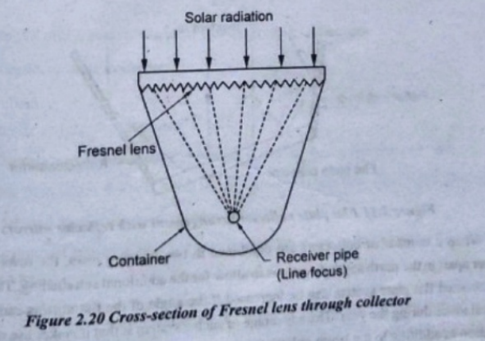
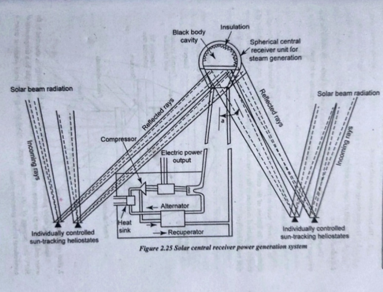
---

### 🔶 Efficiency & Performance of Collectors

* Depends on:

  * **Solar intensity** 🌞
  * **Ambient temperature**
  * **Collector orientation & tilt**
  * **Heat loss**

* Formula:

  $$
  \eta = \frac{Useful\ heat\ output}{Solar\ energy\ received}
  $$

* **Typical Efficiency**:

  * FPC: 30–50%
  * Concentrating: 60–75%

🔍 `diagram: false`
(basic formula, no fixed diagram)

---

### 🔶 Direct Solar Electricity Conversion from Photovoltaic (PV)

* Converts sunlight → electricity using **semiconductors** (like silicon)
* No moving parts, low maintenance

#### ☀️ Working:

1. Sunlight hits solar cell
2. Electrons get energy → move → electric current is generated

🔍 `diagram: true`
**Google Search**: "Solar photovoltaic working diagram"

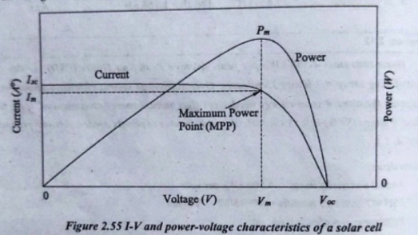

---

### 🔶 Types of Solar Cells

* **Monocrystalline Silicon (Mono-Si)** – High efficiency, expensive
* **Polycrystalline Silicon (Poly-Si)** – Less efficient, cheaper
* **Thin Film Solar Cells** – Flexible, low efficiency
* **Perovskite, Organic, etc.** – Under research

🔍 `diagram: true`
**Google Search**: "Types of solar cells chart"

---

### 🔶 Applications of PV:

* **Battery Charger** – for mobiles, torches, small electronics
* **Domestic Lighting** – home lights during night
* **Street Lighting** – no grid needed
* **Water Pumping** – for irrigation in remote areas
* **Power Generation Schemes**:

  * Rooftop PV systems
  * Off-grid & grid-connected solar plants

🔍 `diagram: true`
**Google Search**: "Solar PV applications diagram"

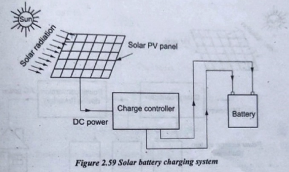
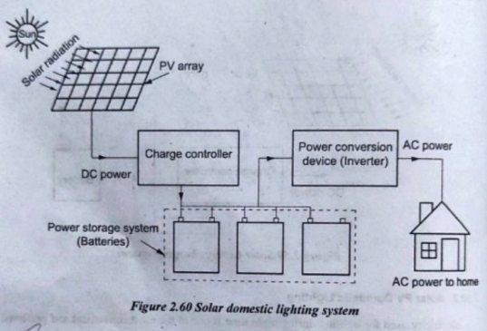
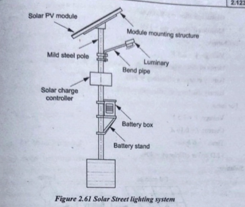
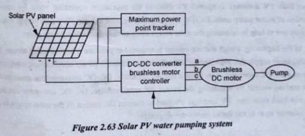
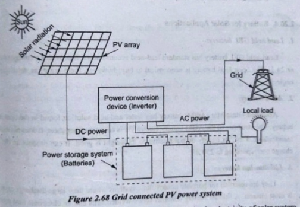

---

### 🔶 Recent Advances in PV: BIPV & Grid-Connected Systems

#### 1. **BIPV (Building Integrated PV):**

* Solar panels built into walls, roofs, windows
* Saves space + adds aesthetics
* Used in smart buildings, airports, malls

#### 2. **Grid-Connected PV:**

* Solar energy is **connected to the main electricity grid**
* Extra power is exported → reduces electricity bill
* Requires **inverter**, **net meter**

🔍 `diagram: true`
**Google Search**: "Building integrated PV system diagram"

**Google Search**: "Grid connected solar PV system diagram"

---

  

## ✅ UNIT III – WIND ENERGY

### 🔹 1. **Wind Energy Principles**

**🔑 Basic Idea:**

* Wind energy is **kinetic energy of moving air**, caused by **solar heating** and **Earth’s rotation**.
* Wind turbines convert this kinetic energy into **mechanical**, then **electrical energy**.

**⚡ Power Equation:**

$$
P = \frac{1}{2} \cdot \rho \cdot A \cdot V^3
$$

Where:

* ρ = Air density (kg/m³)
* A = Swept area of rotor (m²)
* V = Wind speed (m/s)

**Key Point:** Power is **proportional to cube of wind speed** → Even a small increase in speed = massive boost in power output.

📌 **diagram: true**
🔍 *Search:* `wind energy power equation with turbine blade diagram`

---

### 🔹 2. **Wind Site and Resource Assessment**

**Why Site Selection Matters:**

* Wind varies by location. Choosing the wrong site = poor performance & losses.

**🛠️ Tools Used:**

* **Anemometer** – measures wind speed 🌬️
* **Wind Vane** – direction of wind 🧭
* **Wind Rose** – shows frequency of wind directions (pie chart style)
* **LiDAR / SoDAR** – advanced tools to assess wind profile at various heights

**Ideal Site Features:**

* Consistent wind speeds (> 5 m/s at 10m height)
* Low turbulence (flat, open terrain preferred)
* No major obstructions nearby (buildings, trees)
* Available space for rotor blades & tower setup

📌 **diagram: true**
🔍 *Search:* `wind rose diagram site assessment`

---

### 🔹 3. **Wind Assessment**

**Purpose:** Estimate the wind resource and energy output before installing a turbine.

**Key Techniques:**

* **On-site measurements** using masts with sensors (at least 1 year of data).
* **Meteorological station data** (historical analysis).
* **Software modeling tools** (like WAsP) to simulate wind patterns.

**Output:** Wind speed distribution curve (Weibull distribution), monthly averages, and wind energy map of the site.

---

### 🔹 4. **Factors Influencing Wind**

Understanding these helps in better **site planning** and **performance prediction**:

* **Temperature Difference**: Hot air rises → creates pressure difference → wind
* **Altitude**: Wind speed increases with height above ground
* **Coriolis Effect**: Due to Earth’s rotation → wind direction is deflected
* **Topography**: Hills, valleys, forests affect speed & turbulence
* **Time of Day & Season**: Wind varies depending on sunlight & weather

---

### 🔹 5. **Wind Turbine Components**

**🧩 Major Parts (Horizontal Axis Wind Turbine – HAWT):**

| Component         | Function                                  |
| ----------------- | ----------------------------------------- |
| **Blades**        | Capture kinetic energy of wind            |
| **Hub**           | Connects blades to rotor shaft            |
| **Shaft**         | Transfers mechanical power                |
| **Gearbox**       | Increases RPM to generator level          |
| **Generator**     | Converts mechanical to electrical power ⚡ |
| **Nacelle**       | Contains gearbox + generator              |
| **Yaw Mechanism** | Keeps turbine facing wind                 |
| **Brake System**  | Stops rotor in overspeed                  |
| **Tower**         | Raises turbine to ideal wind height       |

📌 **diagram: true**
🔍 *Search:* `wind turbine components labeled diagram`

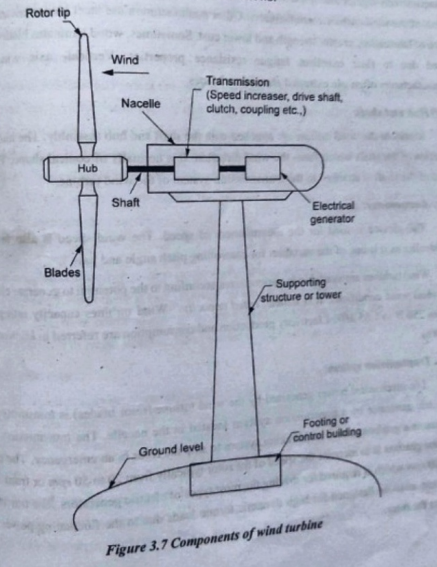
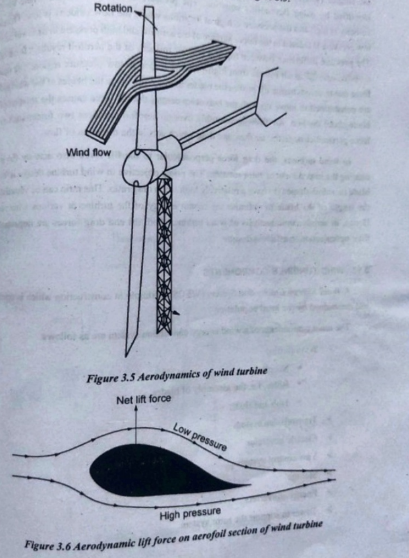

---

### 🔹 6. **Wind Energy Conversion Systems (WECS)**

**🔄 What’s WECS?**
A complete system that captures wind energy and converts it into electrical energy.

**🔧 Major Components:**

* **Rotor**: Blades + hub → rotates with wind
* **Drive train**: Shaft + gearbox
* **Generator**: Produces electricity
* **Controller**: Manages operation (start/stop, pitch control)
* **Output Interface**: Supplies power to grid/battery/load

**💡 Working Flow:**
Wind → Blades spin → Shaft → Gearbox → Generator → Output → Controller → Grid/Storage

---

### 🔹 7. **Classification of WECS Devices**

**By Axis Orientation:**

* **HAWT (Horizontal Axis)**

  * Most used
  * High efficiency
  * Needs wind direction alignment
* **VAWT (Vertical Axis)**

  * Accepts wind from any direction
  * Lower efficiency
  * Used in small-scale setups

**By Capacity:**

| Type   | Capacity       |
| ------ | -------------- |
| Micro  | <100 W         |
| Small  | Up to 10 kW    |
| Medium | 10 kW – 100 kW |
| Large  | >100 kW        |

**By Speed Control:**

* **Stall Control**: Passive method (blade shape limits speed)
* **Pitch Control**: Active method (blade angle adjusted)

📌 **diagram: true**
🔍 *Search:* `HAWT vs VAWT comparison diagram`

---

### 🔹 8. **Wind Electric Generating and Control Systems**

**🌀 Generation System Includes:**

* Rotor → Shaft → Gearbox → Generator

**🎛️ Control Systems Functions:**

* Optimize turbine performance
* Protect system during high wind speeds
* Manage voltage/frequency for grid connection
* Handle starting/stopping sequence

**Two Control Types:**

* **Mechanical Controls** – brakes, yaw system
* **Electrical Controls** – converters, relays, sensors

---

### 🔹 9. **Characteristics of Wind Energy**

| Feature                 | Description                |
| ----------------------- | -------------------------- |
| ✅ Renewable             | Never runs out             |
| 🌍 Clean                | No pollution               |
| 💸 Low Operational Cost | Fuel = free                |
| 📉 Intermittent         | Depends on wind speed      |
| 🛠️ Maintenance         | Low, if monitored properly |
| 🧠 Smart Integration    | Works with hybrid systems  |

---

### 🔹 10. **Applications of Wind Energy**

* **Utility Scale Wind Farms** – Feed power to national grids
* **Standalone Wind Systems** – For rural/remote areas
* **Hybrid Systems** – Wind + Solar/Diesel + Battery
* **Other Uses**:

  * Water pumping
  * Street lighting
  * Charging batteries
  * Telecom towers

---

  

## ✅ UNIT IV – BIO-ENERGY

### 🔹 1. **Energy from Biomass**

#### 🔸 What is Biomass?

* Biomass = Organic material from plants and animals, used as a **renewable fuel** source.
* Examples:

  * Crop residues 🌾
  * Wood chips 🌲
  * Animal dung 💩
  * Food waste 🍲

#### 🔸 Why Biomass?

* Reduces fossil fuel usage 🌍
* Available abundantly in rural areas
* Can generate heat, electricity, and biofuels

---

### 🔹 2. **Biomass Conversion Technologies & Classification**

✅ diagram: true
🔍 Search: `biomass conversion process diagram`

#### 🔸 A. **Thermo-chemical Processes** (Uses heat)

* **Combustion**: Biomass burnt to produce heat/steam.
* **Gasification**: Biomass + limited O₂ → Syngas (CO, H₂).
* **Pyrolysis**: Biomass heated in absence of O₂ → Charcoal, oil, gas.

#### 🔸 B. **Bio-chemical Processes** (Uses microbes)

* **Anaerobic digestion**: Organic waste → Biogas.
* **Fermentation**: Sugar/starch-rich crops → Ethanol.

#### 🔸 C. **Classification of Conversion Methods**

| Type            | Output          | Process Used     |
| --------------- | --------------- | ---------------- |
| Thermo-chemical | Gas, heat       | High-temp burn   |
| Bio-chemical    | Biogas, ethanol | Microbial action |

---

### 🔹 3. **Biogas Generation**

Biogas = **Methane (CH₄)** + CO₂, made when organic matter decomposes anaerobically (no oxygen).

#### 🔸 Biogas Composition:

* CH₄: 50–70%
* CO₂: 30–50%
* Trace: H₂S, water vapor

#### 🔸 Feed Materials:

* Cow dung, kitchen waste, sewage, agro waste

#### 🔸 Output:

* Gas used for cooking, heating, electricity
* Slurry used as organic fertilizer

---

### 🔹 4. **Types of Biogas Plants**

✅ diagram: true
🔍 Search: `types of biogas plant diagrams`

Fixed Dome

Floating Drum

#### 🔸 A. **Fixed Dome Type**:

* Dome-shaped chamber built underground
* Durable, low maintenance
* Common in India 🇮🇳 (ex: Janata Model)

#### 🔸 B. **Floating Drum Type**:

* Gas collects in steel drum that floats on slurry
* Easy to check gas level
* Higher maintenance (drum can rust)

#### 🔸 C. **Other Types**:

* **Balloon plant** (cheap, flexible)
* **Horizontal plant** (for hilly areas)

---

### 🔹 5. **Site Selection for Biogas Plant**

**Factors to consider:**

* Proximity to cattle/feedstock 🐄
* Adequate water supply 💧
* Near energy usage point
* Good sunlight & drainage
* Easy access for maintenance

---

### 🔹 6. **Classification of Biogas Plants (Based on Feeding)**

#### 🔸 A. **Batch Type**:

* Filled once, sealed, emptied after gas production ends
* Good for small-scale use

#### 🔸 B. **Continuous Type**:

* Waste added daily
* Continuous gas supply
* Commonly used in farms

#### 🔸 C. **Semi-batch**:

* Combination of both

| Type       | Feeding | Output  | Use Case         |
| ---------- | ------- | ------- | ---------------- |
| Batch      | Once    | Limited | Low demand areas |
| Continuous | Daily   | Stable  | Farms & villages |

---

### 🔹 7. **Advantages & Disadvantages of Biogas**

| ✅ Advantages                           | ❌ Disadvantages                       |
| -------------------------------------- | ------------------------------------- |
| Free fuel from waste                   | Initial setup cost is high 💸         |
| Reduces deforestation and pollution    | Inefficient in cold climates ❄️       |
| Produces organic manure as by-product  | Skilled maintenance may be needed     |
| Energy self-sufficiency in rural areas | Corrosion in metal parts (H₂S effect) |

---

### 🔹 8. **Thermal Gasification of Biomass**

✅ diagram: true
🔍 Search: `biomass gasification diagram`

#### 🔸 What is it?

Converts solid biomass into **producer gas (CO, H₂, CH₄)** by reacting at **800–1000°C** with limited oxygen.

#### 🔸 Process Steps:

1. Drying
2. Pyrolysis
3. Oxidation
4. Reduction → Gas output

#### 🔸 Uses:

* Electricity generation
* Cooking fuel
* Industrial heating

---

### 🔹 9. **Biomass Gasifiers**

Device used for biomass gasification.

#### 🔸 Types:

* **Updraft Gasifier**: Air enters from below, gas exits top
* **Downdraft Gasifier**: Air and gas flow downwards
* **Fluidized Bed Gasifier**: Biomass floats in hot air for uniform conversion

#### 🔸 Applications:

* Small power plants
* Village microgrids
* Backup fuel for diesel engines

---

### 🔹 10. **Applications of Biomass & Biogas Plants**

✅ diagram: true
🔍 Search: `applications of biomass and biogas`

#### 🔸 A. Biomass Applications:

* Thermal energy for industries
* Electricity for rural microgrids
* Briquettes for cooking
* Production of ethanol/biodiesel

#### 🔸 B. Biogas Applications:

* Cooking gas in homes
* Street lighting & electricity
* Engine fuel (dual-fuel use)
* Organic farming (slurry used as manure)

---

### 💰 Economics of Biomass & Biogas

#### 🔸 Cost Factors:

* Size of plant
* Availability of feedstock
* Labour & maintenance

#### 🔸 Benefits:

* Fast payback (2–4 years)
* Government subsidies 💰
* Employment generation (rural jobs)

#### 🔸 Government Schemes:

* **GOBAR-Dhan Yojana**
* **MNRE Biogas Support Program**
* **State-level renewable policies**

---

  

# ✅ UNIT V – OTHER TYPES OF ENERGY

## ⚗️ 1. **Hydrogen Energy and Fuel Cells**

### 🔹 What is Hydrogen Energy?

* **Hydrogen** is an **energy carrier**, not a primary source.
* Can be produced via:

  * **Electrolysis of water**
  * **Steam reforming of natural gas**
* Clean fuel when used — no CO₂, only water vapor.

### 🔹 Fuel Cells: Principle & Operation

* Converts **chemical energy of hydrogen + oxygen** → **electrical energy + water**
* No combustion involved, it's an **electrochemical reaction**.

### 🔹 Types of Fuel Cells:

| Type  | Electrolyte      | Common Use                 |
| ----- | ---------------- | -------------------------- |
| PEMFC | Polymer Membrane | Vehicles, portable devices |
| SOFC  | Solid oxide      | Stationary power plants    |
| AFC   | Alkaline         | Space missions             |

### 🔹 Pros ✅ / Cons ❌

* ✅ High efficiency (60–70%)
* ✅ Zero emissions
* ❌ High cost
* ❌ Hydrogen storage is complex

> **diagram: true** – Search: `working of hydrogen fuel cell`, `PEMFC diagram`
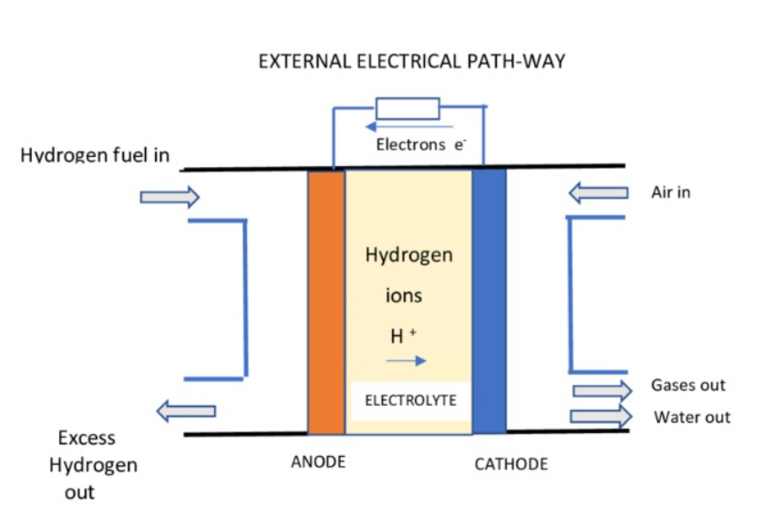

---

## 🌋 2. **Geothermal Energy**

### 🔹 What Is It?

* Energy from **heat inside Earth’s crust**
* Used for heating, electricity generation, direct applications (like greenhouses)

### 🔹 Types of Geothermal Resources

* **Dry steam**
* **Wet steam**
* **Hot dry rock**

### 🔹 Types of Wells

* **Production Well**: Extracts steam/hot water
* **Injection Well**: Returns used fluid to maintain pressure

### 🔹 Methods of Harnessing

* **Dry steam plant** – oldest, uses natural steam
* **Flash steam plant** – converts hot water into steam
* **Binary cycle** – transfers heat to secondary fluid (used when temp is low)

### 🔹 Potential in India

* **Puga (Ladakh), Manikaran (HP), Tattapani (Chhattisgarh)**

> **diagram: true** – Search: `geothermal power plant types`, `flash steam geothermal plant`

---

## 🌊 3. **OTEC – Ocean Thermal Energy Conversion**

### 🔹 What is OTEC?

* Generates power using **temperature difference** between **warm surface water** (\~25°C) and **cold deep water** (\~5°C)
* Only works in **tropical oceans** 🌴

### 🔹 Working Principles

* Heat from warm surface water boils a **working fluid** → drives turbine → power.

### 🔹 Thermodynamic Cycles:

* **Closed Cycle**: Uses fluid like ammonia.
* **Open Cycle**: Uses sea water directly.
* **Hybrid Cycle**: Mix of both.

### 🔹 Site Conditions

* Minimum temp difference = **20°C**
* Best for **coastal and island regions**

> **diagram: true** – Search: `OTEC plant working`, `closed cycle OTEC system diagram`

open cycle OTEC

closed cycle OTEC

---

## 🌊 4. **Tidal and Wave Energy**

### 🔹 Tidal Energy

* Caused by **gravitational pull** of the moon + sun 🌕🌊
* Types:

  * **Tidal barrage** (dam-like)
  * **Tidal stream** (uses underwater turbines)
  * **Dynamic tidal power**

### 🔹 Wave Energy

* Comes from **surface waves** formed by wind
* Conversion Devices:

  * **Oscillating water column**
  * **Point absorbers**
  * **Overtopping devices**

### 🔹 Comparison

| Aspect         | Tidal  | Wave       |
| -------------- | ------ | ---------- |
| Predictability | High   | Moderate   |
| Tech Maturity  | Higher | Developing |
| Cost           | High   | Very high  |

> **diagram: true** – Search: `tidal barrage diagram`, `wave energy converter diagram`

Tidal Barrage Diagram

Point Absorber

---

## 💧 5. **Mini-Hydel Power Plants and Their Economics**

### 🔹 What Is Mini-Hydel?

* Small hydroelectric power systems **(<25 MW)**
* No large dams needed; **run-of-river** most common.

### 🔹 Types of Mini-Hydel:

* **Canal-based**
* **Dam-toe**
* **Diversion-type**

### 🔹 Components:

* **Intake → Penstock → Turbine → Generator → Tailrace**

### 🔹 Economic Aspects:

* Initial cost: ₹7–10 Cr per MW
* O\&M cost: Very low
* Life span: 30+ years
* Suitable for **rural electrification**

> **diagram: true** – Search: `mini hydel plant layout`, `run-of-river hydro system diagram`

---
  

# 13 Marks 

  

## Unit 1
---

### **1. Classify sources of energy.**

📌 **diagram: true**
🔍 *Google search:* `classification of energy sources diagram`

**Classification of Energy Sources**

Energy sources can be broadly classified based on:

#### 1. **Renewability**

* **Renewable Energy Sources**

  * Naturally replenished.
  * Examples: Solar 🌞, Wind 💨, Biomass 🌿, Hydro 💧, Geothermal 🌋, Tidal 🌊.

* **Non-Renewable Energy Sources**

  * Limited in nature, takes millions of years to form.
  * Examples: Coal, Petroleum, Natural Gas, Nuclear fuels.

#### 2. **Commercial vs Non-Commercial**

* **Commercial Sources**

  * Bought and sold in the market.
  * Eg: Electricity, Petrol, LPG.

* **Non-Commercial Sources**

  * Not traded, used locally.
  * Eg: Firewood, animal waste, agricultural waste.

#### 3. **Primary vs Secondary**

* **Primary Sources**

  * Found in nature directly.
  * Eg: Solar, Coal, Wind.

* **Secondary Sources**

  * Processed from primary.
  * Eg: Electricity, Hydrogen, Petrol.

---

### **2. Write short notes on conventional energy sources and renewable energy sources.**

📌 **diagram: false**

**Conventional Energy Sources (Non-Renewable):**

* Fossil fuels like coal, petroleum, and natural gas.
* Nuclear energy.
* **Features:**

  * Limited availability.
  * High environmental pollution (CO₂ emissions).
  * Easy to transport and store.
  * Dominates global energy use.

**Renewable Energy Sources:**

* Solar, Wind, Hydro, Biomass, Geothermal, Tidal.
* **Features:**

  * Eco-friendly 🌱.
  * Replenishable.
  * High initial cost but low running cost.
  * Requires advanced tech for storage and grid integration.

---

### **3. Give brief review of various sources of renewable energy. Describe the energy scenario of India.**

📌 **diagram: true**
🔍 *Google search:* `renewable energy sources chart India`

**Renewable Energy Sources in Brief:**

* **Solar Energy:** Harnessed via solar panels or thermal systems.
* **Wind Energy:** Captured using wind turbines.
* **Biomass:** Organic matter converted into biogas or fuel.
* **Hydropower:** Water flow used to generate electricity.
* **Geothermal:** Heat from Earth’s crust used for heating or electricity.
* **Tidal/Wave Energy:** Marine sources; limited use but potential in coastal areas.

**Energy Scenario of India:**

* India is **one of the top 5** countries in renewable capacity 🌏.
* As of recent reports:

  * Solar: \~70+ GW
  * Wind: \~40+ GW
  * Hydro: \~45+ GW
  * Biomass: \~10+ GW
* Government target: 500 GW by 2030 (as part of COP26 commitment).
* Major investments in solar parks and wind corridors (TN, Gujarat, Rajasthan).

---

### **4. Briefly Explain the conventional energy scenario of India.**

📌 **diagram: false**

**Conventional Energy in India:**

* Heavy dependence on **coal**, accounting for \~55% of electricity generation.
* **Petroleum and natural gas** used for transport and industry.
* **Nuclear energy** contributes a small but important share (\~7 GW).
* Major Challenges:

  * Depletion of fossil fuel reserves.
  * High carbon emissions.
  * Energy import burden (India imports >80% of its oil).

**Steps taken:**

* National Energy Policy.
* Promotion of cleaner fuels (e.g., CNG, biofuels).
* Diversifying energy mix with renewables.

---

### **5. Discuss the present status of world energy scenario.**

📌 **diagram: true**
🔍 *Google search:* `world energy mix pie chart 2024`

**Global Energy Scenario:**

* World demand increasing rapidly due to population growth and industrialization.
* **Current Energy Mix (approx.):**

  * Oil: \~30%
  * Coal: \~25%
  * Natural Gas: \~23%
  * Renewables: \~17%
  * Nuclear: \~5%

**Trends:**

* Shift toward renewable energy due to climate goals.
* Rising investments in solar and wind.
* Europe leading in renewable integration.
* Developing countries (like India, China) are also scaling up.
* Fossil fuels still dominate, but their growth is slowing.

---

### **6. List the advantages and limitations of renewable energy.**

📌 **diagram: false**

**Advantages:**

* Eco-friendly 🌍
* Renewable and sustainable.
* Reduces dependency on imported fuels.
* Reduces greenhouse gas emissions.
* Job creation in rural areas.

**Limitations:**

* High initial setup cost.
* Requires large land area (solar/wind).
* Dependent on weather/climate.
* Grid integration challenges.
* Limited energy density vs fossil fuels.

---

### **7. Enumerate the renewable energy consumption in various sectors.**

📌 **diagram: true**
🔍 *Google search:* `sector wise renewable energy consumption India`

**Sector-wise Consumption:**

| Sector          | Renewable Source Used                    |
| --------------- | ---------------------------------------- |
| **Electricity** | Solar, Wind, Hydro, Biomass              |
| **Agriculture** | Biogas, Solar Pumps                      |
| **Transport**   | Biofuels (Ethanol, Biodiesel) 🚗         |
| **Industry**    | Biomass for heating, solar steam boilers |
| **Residential** | Solar water heaters, Biogas for cooking  |
| **Commercial**  | Solar rooftops, Hybrid energy systems    |

**Key Points:**

* Solar is widely used for lighting and pumping in rural India.
* Wind and solar dominate electricity production in the renewable sector.
* Bioenergy is common in villages and small-scale industries.

---

  

## Unit 2
---

### **1. Explain the working of pyranometer and pyrheliometer with help of neat sketch.**

📌 **diagram: true**
🔍 *Google search:* `pyranometer and pyrheliometer diagram`

**Pyranometer:**

* Measures **global solar radiation** (direct + diffuse).
* **Working Principle:**

  * Uses a thermopile sensor covered by a glass dome.
  * When solar radiation hits the black-coated surface, it heats up, creating a voltage difference.
* **Application:** Placed horizontally to measure total solar irradiance (W/m²).

**Pyrheliometer:**

* Measures **direct beam solar radiation**.
* **Working Principle:**

  * Uses a collimated tube aligned to the sun.
  * Only allows direct sunlight through a narrow opening.
  * The thermopile inside measures the heat energy.

---

### **2. Discuss the construction and working principle of central receiver power plants.**

📌 **diagram: true**
🔍 *Google search:* `central receiver solar tower diagram`

**Construction:**

* Thousands of **heliostats** (sun-tracking mirrors).
* Central **receiver/tower**.
* **Heat transfer fluid (HTF)**: molten salt or air.
* **Thermal storage system** and **turbine generator**.

**Working:**

* Heliostats focus sunlight onto the receiver.
* Heat energy is transferred to HTF.
* The fluid is sent to a heat exchanger → steam → turbine → electricity.
* High efficiency due to extreme focus and high temp.

**Use:** Grid-connected solar power generation.

---

### **3. Explain with a neat sketch working of a parabolic trough solar power plant.**

📌 **diagram: true**
🔍 *Google search:* `parabolic trough solar collector diagram`

**Construction:**

* Long parabolic mirrors aligned to track sun east to west.
* **Receiver tube** at focus point with HTF (usually oil).
* HTF flows through insulated pipes → heat exchanger → steam turbine.

**Working:**

* Sunlight hits the parabolic mirror.
* Reflected rays focus on the receiver pipe.
* The HTF gets heated to \~400°C.
* Steam is produced to rotate turbines and generate power.

**Advantages:**

* Modular and widely used.
* Thermal storage possible.

---

### **4. Explain the Perturb and Observe MPPT algorithm with a flowchart.**

📌 **diagram: true**
🔍 *Google search:* `perturb and observe MPPT flowchart`

**MPPT (Maximum Power Point Tracking):**

* Ensures **maximum power** is extracted from a solar panel despite changing conditions.

**Perturb and Observe Algorithm:**

* Slightly **perturbs voltage**, observes power change.
* If power increases → continue perturbing in same direction.
* If power decreases → reverse direction.
* Repeats to find peak point on the I-V curve.

**Flowchart Explanation:**

* Start → Measure V & I → Compute Power (P=V×I) → Compare with previous power → Adjust voltage → Repeat.

---

### **5. Explain the I-V characteristics of a solar cell with a neat sketch.**

📌 **diagram: true**
🔍 *Google search:* `I-V characteristics solar cell diagram`

**I-V Curve Explanation:**

* Shows relationship between **current (I)** and **voltage (V)** of a solar cell.
* Starts from **short circuit current (Isc)** to **open circuit voltage (Voc)**.
* **Maximum Power Point (MPP):** Where product of V×I is maximum.
* **Fill Factor (FF):** MPP / (Isc × Voc).
* **Efficiency:** (Output Power / Incident Solar Power) × 100.

**Influencing Factors:**

* Light intensity.
* Temperature.
* Shading.

---

### **6. Solar PV Lighting**

📌 **diagram: false**

**Components:**

* PV panel, Battery, LED lamp, Charge controller.

**Working:**

* PV panel charges the battery during the day.
* At night, the charge controller powers the LED from the battery.
* Auto ON/OFF using sensors (like LDR).

**Advantages:**

* Energy efficient.
* Useful in remote & rural areas.
* Low maintenance.

---

### **7. Solar Water Pumping System**

📌 **diagram: true**
🔍 *Google search:* `solar water pump system diagram`

**Components:**

* PV panel, Pump (AC or DC), Controller, Motor.

**Working:**

* Sunlight powers PV panel → electrical power drives the motor → pump draws water from well/tank.
* Can be surface or submersible type.
* Ideal for agriculture 🌾.

**Types:**

* DC motor pumps (direct connection).
* AC pumps with inverter.

---

### **8. Solar PV Battery Charging & Solar PV Street Lighting**

📌 **diagram: true**
🔍 *Google search:* `solar battery charger diagram`, `solar street light diagram`

**Battery Charging:**

* PV panel charges a **lead-acid or Li-ion battery** through a **charge controller**.
* Prevents overcharging and deep discharge.

**Street Lighting:**

* PV panel + battery + LED lamp.
* Auto switch-on using dusk-to-dawn sensor.
* Ideal for remote villages and highways.

**Advantages:**

* Zero electricity bill.
* Grid-independent.
* Long lifespan.

---

### **9. Recent Advances in Solar PV Cell Applications**

📌 **diagram: true**
🔍 *Google search:* `building integrated PV systems`, `grid connected PV systems diagram`

#### 1. **Building Integrated PV (BIPV):**

* PV panels are built into walls, windows, or roofs.
* Dual purpose: power + aesthetics.
* Eg: Solar roof tiles.

#### 2. **Standalone Power System:**

* Not connected to the grid.
* Used in remote areas (villages, forests).
* Includes battery + inverter + charge controller.

#### 3. **Grid Connected PV Systems:**

* Solar power is fed directly to the grid.
* No batteries needed.
* Net metering helps track export-import of power.

**Benefits:**

* Efficient land use.
* Reduced transmission loss.
* Sustainable urban development.

---

  

## Unit 3

---

### **1. Discuss the various considerations taken into account for site selection of a wind energy system.**

📌 **diagram: false**

**Key Considerations:**

1. **Wind Speed Availability:**

   * Minimum avg. wind speed: 5–6 m/s at 30–50 meters height.
   * Higher wind = more power (Power ∝ v³).

2. **Topography:**

   * Flat open areas, hilltops, coastal regions preferred.
   * Avoid turbulence (valleys, urban obstacles).

3. **Wind Consistency:**

   * Steady wind flow throughout the year.
   * Low variation ensures efficient generation.

4. **Accessibility:**

   * Roads for transportation of turbine parts.
   * Close to load centers or grid access.

5. **Environmental & Social Impact:**

   * Minimal disturbance to wildlife, noise, or shadow flicker.
   * Far from residential zones.

6. **Land Availability:**

   * Large open areas for installation and maintenance.
   * Agricultural lands can be dual-used.

---

### **2. Clearly explain the principle of WECS with neat block diagram.**

📌 **diagram: true**
🔍 *Google search:* `wind energy conversion system block diagram`

**Principle of WECS (Wind Energy Conversion System):**

* Converts **kinetic energy** of wind → **mechanical energy** → **electrical energy**.

**Block Diagram Explanation:**

1. **Wind Turbine Blades** – capture kinetic energy from wind.
2. **Rotor/Hub** – rotates as blades turn.
3. **Gearbox** – steps up low RPM from rotor to high RPM for generator.
4. **Generator** – converts mechanical energy into electricity.
5. **Controller & Power Conditioning** – stabilizes voltage and frequency.
6. **Output** – electrical energy sent to grid or load.

**Basic Formula:**
$P = \frac{1}{2} \rho A V^3 \eta$
Where:

* ρ = Air density, A = Area swept by blades, V = Wind speed, η = efficiency.

---

### **3. Describe the working of a wind power system and its components with a neat schematic diagram.**

📌 **diagram: true**
🔍 *Google search:* `wind turbine components diagram schematic`

**Working Process:**

* Wind hits the turbine blades → rotates rotor.
* Gearbox amplifies speed → spins generator.
* Generator creates AC or DC power.
* Power is regulated and either stored or sent to grid.

**Main Components:**

1. **Rotor Blades:** 2 or 3 blades to harness wind energy.
2. **Hub & Shaft:** Connects rotor to gearbox.
3. **Gearbox:** Increases shaft speed.
4. **Generator:** Converts mechanical → electrical energy.
5. **Yaw Mechanism:** Aligns turbine with wind direction.
6. **Brake System:** Stops turbine in overspeed or maintenance.
7. **Tower:** Supports the whole structure.

---

### **4. Explain the working principle of vertical axis and horizontal axis wind mill.**

📌 **diagram: true**
🔍 *Google search:* `horizontal vs vertical axis wind turbine diagram`

**Horizontal Axis Wind Turbine (HAWT):**

* Rotor shaft is **parallel to wind direction**.
* Blades rotate around horizontal axis.
* **Needs yaw control** to face wind.
* High efficiency & used in commercial wind farms.

**Vertical Axis Wind Turbine (VAWT):**

* Rotor shaft is **perpendicular to wind direction**.
* No need for yaw mechanism.
* Operates in turbulent winds, ideal for urban use.
* Lower efficiency than HAWT.

**Comparison Table:**

| Feature             | HAWT             | VAWT                |
| ------------------- | ---------------- | ------------------- |
| Orientation         | Horizontal       | Vertical            |
| Efficiency          | High             | Medium              |
| Wind Direction Req. | Needs yaw        | Omnidirectional     |
| Maintenance         | Hard (tower-top) | Easy (ground-level) |

---

### **5. Enumerate any two types of control systems adopted in wind turbine.**

📌 **diagram: false**

**1. Pitch Control:**

* Adjusts blade angle to control rotor speed.
* Reduces aerodynamic force when wind speed is too high.
* Helps maintain constant RPM and avoid damage.

**2. Yaw Control:**

* Aligns rotor to face wind direction using sensors and motors.
* Improves efficiency by maximizing wind capture.

**Other Controls (just a mention):**

* Stall Control
* Brake Control
* Power Electronic Controllers

---

### **6. Classification of WECS devices**

📌 **diagram: false**

**Based on Axis of Rotation:**

* **Horizontal Axis (HAWT)**
* **Vertical Axis (VAWT)**

**Based on Output Power:**

* Micro (< 1 kW)
* Small (1–10 kW)
* Medium (10–100 kW)
* Large (>100 kW)

**Based on Power Regulation:**

* Stall-regulated
* Pitch-regulated

**Based on Connection:**

* **Grid connected**
* **Stand-alone**

**Based on Speed:**

* **Constant-speed**
* **Variable-speed**

---

### **7. Types of wind power plants.**

📌 **diagram: true**
🔍 *Google search:* `types of wind power plants diagram`

1. **Onshore Wind Farms:**

   * Built on land (hills, plains).
   * Easy access and low cost.

2. **Offshore Wind Farms:**

   * Located in sea or oceans.
   * Higher consistent wind speed = more power.
   * Expensive installation and maintenance.

3. **Distributed Wind Systems:**

   * Small turbines near homes, schools, or farms.
   * Used locally, sometimes off-grid.

4. **Hybrid Systems:**

   * Wind + Solar or Diesel for continuous supply.
   * Ideal for remote or island areas.

---
  

## Unit 4

---

### **1. Explain the various biomass resources.**

📌 **Diagram: false**

**Biomass Resources** are organic materials used to produce energy. They can be solid, liquid, or gas-based and are classified as follows:

1. **Agricultural Residues:**

   * Examples: Straw, husk, stalks, corn cobs.
   * By-products of crop harvesting.

2. **Forestry Residues:**

   * Tree bark, wood chips, sawdust, forest floor litter.

3. **Animal Waste:**

   * Cow dung, poultry litter, pig waste.
   * Used mainly in biogas production.

4. **Industrial Waste:**

   * From food processing, paper industries (bagasse, spent grains).

5. **Urban Organic Waste:**

   * Kitchen waste, vegetable waste, garden trimmings, sewage sludge.

6. **Energy Crops:**

   * Plants grown specifically for bioenergy (e.g., switchgrass, sugarcane).

These are **renewable**, help reduce waste, and support **sustainable energy generation**.

---

### **2. Discuss the biomass conversion technologies and explain any one in detail.**

📌 **Diagram: true**
🔍 *Google search:* `biomass conversion technologies block diagram`

**Types of Biomass Conversion Technologies:**

1. **Thermochemical Conversion:**

   * *Combustion:* Burning biomass for heat or steam.
   * *Gasification:* Conversion into syngas.
   * *Pyrolysis:* Heating without oxygen → bio-oil + gas + char.

2. **Biochemical Conversion:**

   * Anaerobic digestion → Biogas.
   * Fermentation → Ethanol.

3. **Chemical Conversion:**

   * Transesterification to produce biodiesel.

✅ **Detail – Anaerobic Digestion (Biochemical method):**

* Microorganisms decompose organic waste in absence of oxygen.
* Produces **biogas (CH₄ + CO₂)** and **slurry**.
* Used in rural areas for cooking, lighting, and manure.

---

### **3. Explain the biochemical process to convert biomass into energy.**

📌 **Diagram: true**
🔍 *Google search:* `anaerobic digestion process diagram`

The **biochemical process** mainly involves **anaerobic digestion** and **fermentation**.

1. **Anaerobic Digestion:**

   * *Step 1: Hydrolysis* – Complex molecules → simple sugars.
   * *Step 2: Acidogenesis* – Sugars → volatile fatty acids.
   * *Step 3: Acetogenesis* – Fatty acids → acetic acid, H₂, CO₂.
   * *Step 4: Methanogenesis* – Acetic acid & gases → Methane (CH₄).

2. **Fermentation:**

   * Converts carbohydrates into **ethanol** or **lactic acid** using microbes.
   * Sugarcane, corn → Ethanol (used as fuel blend).

**Products:**

* Biogas (used for energy).
* Ethanol/Biodiesel (used in vehicles).

---

### **4. Explain the operation of biogas plant and discuss combustion characteristics.**

📌 **Diagram: true**
🔍 *Google search:* `biogas plant working diagram`

**Working of a Biogas Plant:**

1. **Feedstock (e.g., cow dung + water)** is fed into the **digester tank**.
2. Anaerobic digestion occurs, producing **biogas**.
3. Gas is collected in the **gas holder** and piped to usage points.
4. Leftover slurry exits to the **slurry pit** and used as fertilizer.

**Combustion Characteristics:**

* Main component: **Methane (50–60%)**.
* Calorific value: \~20–25 MJ/m³.
* Clean, smokeless, and low in sulfur.
* Ideal for domestic cooking, lighting, and heating.

---

### **5. Explain the construction and working of any two types of biogas digester with neat sketch.**

📌 **Diagram: true (2 sketches)**
🔍 *Google search:* `floating drum and fixed dome biogas plant diagram`

**1. Floating Drum Type:**

* Digester tank made of brick or concrete.
* Gas holder floats over slurry surface.
* Gas pressure is constant, but maintenance is higher (corrosion issues).

**2. Fixed Dome Type:**

* Dome-shaped gas storage is fixed.
* Gas pressure varies with quantity.
* Less maintenance, more durable.

**Working is similar:**
Organic matter + water → fermentation → gas collection → usage → slurry as manure.

---

### **6. Explain any two types of gasifiers with neat line diagram.**

📌 **Diagram: true (2 diagrams)**
🔍 *Google search:* `updraft and downdraft gasifier diagram`

**1. Updraft Gasifier:**

* Biomass enters from top, air from bottom.
* Heat flows upwards.
* High efficiency, but tar content is high.

**2. Downdraft Gasifier:**

* Both biomass and air enter from the top.
* Gases pass through a hot zone → low tar content.
* Suitable for engines and small-scale electricity.

**Working Principle:**
Gasifiers convert solid biomass → **producer gas** (CO, H₂, CH₄) via **partial combustion**.

---
  

## Unit 5

---

### **1. Discuss the principle of operation of a fuel cell with neat sketch.**

📌 **Diagram: Required**
🔍 *Search on Google:* `PEM fuel cell working diagram`

**Fuel Cell Principle:**
A **fuel cell** is an electrochemical device that converts **chemical energy** (usually hydrogen) into **electrical energy**.

**How it Works (PEMFC as example):**

* **Anode Reaction:**
  H₂ → 2H⁺ + 2e⁻
* **Electrolyte:**
  Allows only H⁺ ions to pass through.
* **Cathode Reaction:**
  ½O₂ + 2H⁺ + 2e⁻ → H₂O
* **Output:**
  Electricity + Water + Heat

It works continuously as long as **fuel (H₂)** and **oxidant (O₂)** are supplied.

---

### **2. Explain the construction of various types of fuel cells.**

📌 **Diagram: Required (any two)**
🔍 *Search on Google:*

* `alkaline fuel cell diagram`
* `SOFC diagram`
* `PEM fuel cell layers`

**Types of Fuel Cells:**

1. **PEMFC (Proton Exchange Membrane):**

   * Uses solid polymer as electrolyte.
   * Operates at \~80°C.
   * Used in vehicles and backup systems.

2. **AFC (Alkaline Fuel Cell):**

   * Uses KOH solution as electrolyte.
   * High efficiency but CO₂ sensitive.
   * Used in space applications.

3. **SOFC (Solid Oxide Fuel Cell):**

   * Ceramic electrolyte.
   * Operates at high temp (\~1000°C).
   * Used in industrial power generation.

4. **MCFC (Molten Carbonate Fuel Cell):**

   * Uses molten carbonates as electrolyte.
   * Suitable for large-scale power plants.

Each type differs in **electrolyte, operating temp**, and **application**.

---

### **3. Explain the principle and working of geothermal power plant with a neat sketch.**

📌 **Diagram: Required**
🔍 *Search:* `geothermal power plant working diagram`

**Geothermal Energy Principle:**
Uses heat from beneath Earth’s surface to generate power.

**Types of Geothermal Plants:**

1. **Dry Steam Plant:**

   * Uses steam directly from underground to spin turbine.

2. **Flash Steam Plant:**

   * Hot water under pressure is depressurized → flash to steam → turbine.

3. **Binary Cycle Plant:**

   * Transfers geothermal heat to a low-boiling fluid → vaporizes → spins turbine.

**Advantages:**

* Low emissions
* Reliable base load power
* Small land use

---

### **4. Explain the principle of operation of open cycle and closed cycle OTEC system.**

📌 **Diagram: Required (Both)**
🔍 *Search:*

* `open cycle OTEC diagram`
* `closed cycle OTEC diagram`

**OTEC (Ocean Thermal Energy Conversion):**
Uses temperature difference between **warm surface water** and **cold deep water** to generate electricity.

**1. Open Cycle:**

* Warm surface seawater is evaporated at low pressure.
* Steam drives turbine.
* Steam condensed by cold deep seawater.

**2. Closed Cycle:**

* Warm seawater heats a working fluid (e.g., ammonia).
* Vaporized fluid spins turbine.
* Condensed by cold seawater and reused.

**India Potential:**
Tamil Nadu, Lakshadweep — warm ocean zones.

---

### **5. Briefly discuss the components of tidal power systems with a neat block diagram.**

📌 **Diagram: Required**
🔍 *Search:* `tidal power plant components block diagram`

**Tidal Energy Principle:**
Uses the **rise and fall of sea level** due to moon's gravity to produce electricity.

**Main Components:**

1. **Barrage (Dam-like structure):**

   * Built across an estuary.
2. **Tidal Basin:**

   * Stores high tide water.
3. **Sluice Gates:**

   * Controls water flow.
4. **Turbines:**

   * Spins during in-flow and out-flow.

**Working:**

* Water stored during high tide → released during low tide → spins turbines → generates electricity.

---

### **6. Describe the working principle of HATT and VATT.**

📌 **Diagram: Optional but useful**
🔍 *Search:* `HATT vs VATT diagram`

These are types of **hydrokinetic turbines** (used in tidal/wave energy systems):

**1. HATT (Horizontal Axis Tidal Turbine):**

* Axis of rotation is parallel to water flow.
* Like a wind turbine under water.
* High efficiency in fast-moving tides.
* Needs flow direction alignment.

**2. VATT (Vertical Axis Tidal Turbine):**

* Axis perpendicular to water flow.
* Works regardless of flow direction.
* Easier installation, less efficient.
* More drag losses than HATT.

**Comparison:**

| Feature        | HATT          | VATT             |
| -------------- | ------------- | ---------------- |
| Axis           | Horizontal    | Vertical         |
| Directionality | One direction | Omni-directional |
| Efficiency     | High          | Moderate         |
| Installation   | Complex       | Easier           |

---

  

# 2 Marks

  

---

### ✅ **UNIT I – INTRODUCTION**

1. **Define primary energy source.**
   → Energy sources found in nature and not processed (e.g., coal, sunlight, wind).

2. **What is meant by renewable energy?**
   → Energy that is naturally replenished, like solar or wind energy.

3. **List any two non-renewable energy sources.**
   → Coal, petroleum.

4. **Mention any two renewable energy resources in India.**
   → Solar energy, wind energy.

5. **Define energy conversion.**
   → Changing energy from one form to another (e.g., solar to electricity).

6. **What is the future potential of renewable energy in India?**
   → High potential due to sunlight availability and long coastline.

7. **State any two advantages of renewable energy.**
   → Eco-friendly, infinite availability.

8. **Write any two differences between renewable and non-renewable sources.**
   → Renewable is unlimited & clean, non-renewable is limited & polluting.

9. **What is energy sustainability?**
   → Meeting present energy needs without harming future needs.

10. **Mention two factors driving renewable energy development.**
    → Climate change, energy security.

11. **Define power generation capacity.**
    → Maximum electricity a plant can produce (in MW or GW).

12. **Name two organizations promoting renewable energy in India.**
    → MNRE, IREDA.

13. **List any two challenges in implementing renewable energy in India.**
    → High initial cost, grid integration.

14. **What is the role of MNRE?**
    → Promotes and develops renewable energy in India.

15. **Define distributed generation.**
    → Power generation at or near the point of use.

---

### ☀️ **UNIT II – SOLAR ENERGY**

1. **What is solar radiation?**
   → Sunlight received on Earth’s surface.

2. **Name any two instruments used to measure solar radiation.**
   → Pyranometer, Pyrheliometer.

3. **What is a flat plate collector?**
   → A device to collect solar heat using a flat absorber surface.

4. **Define solar thermal energy.**
   → Heat energy from the sun used for heating applications.

5. **State the principle of photovoltaic conversion.**
   → Converts sunlight directly into electricity using solar cells.

6. **What is a concentrating solar collector?**
   → Uses mirrors/lenses to focus sunlight on a small area.

7. **Mention two types of solar cells.**
   → Monocrystalline, Polycrystalline.

8. **What is the use of MPPT in solar PV systems?**
   → Maximizes power output from solar panels.

9. **List two applications of solar energy in households.**
   → Solar water heaters, solar lighting.

10. **What is the typical efficiency of a commercial solar cell?**
    → Around 15% to 22%.

11. **Define solar insolation.**
    → Amount of solar radiation received per square meter.

12. **Mention one advantage and one disadvantage of photovoltaic systems.**
    → Advantage: Low maintenance. Disadvantage: High initial cost.

13. **What is the function of a solar charge controller?**
    → Regulates battery charging from solar panels.

14. **What is BIPV?**
    → Building-Integrated Photovoltaics – solar panels built into buildings.

15. **Define grid-connected PV system.**
    → Solar system connected to the utility grid.

---

### 🌬 **UNIT III – WIND ENERGY**

1. **Define wind energy.**
   → Energy obtained from moving air (wind).

2. **What causes wind?**
   → Uneven heating of Earth’s surface by the sun.

3. **List any two factors influencing wind energy.**
   → Wind speed, air density.

4. **What is the principle of wind energy conversion?**
   → Converts kinetic energy of wind into mechanical/electrical energy.

5. **What is a wind turbine?**
   → A device that converts wind energy into electricity.

6. **Mention two components of a wind turbine.**
   → Rotor blades, nacelle.

7. **Define swept area in wind turbine.**
   → Area covered by rotating blades.

8. **What is WECS?**
   → Wind Energy Conversion System.

9. **Differentiate between HAWT and VAWT.**
   → HAWT: Horizontal axis; VAWT: Vertical axis.

10. **Mention any two wind assessment tools.**
    → Anemometer, wind vane.

11. **What is tip-speed ratio?**
    → Ratio of blade tip speed to wind speed.

12. **State any two applications of wind energy.**
    → Electricity generation, water pumping.

13. **Define wind power density.**
    → Power per unit area from wind.

14. **What is a wind farm?**
    → Group of wind turbines generating power together.

15. **What is yaw control in wind turbines?**
    → System to keep rotor facing wind direction.

---

### 🌱 **UNIT IV – BIO-ENERGY**

1. **What is biomass?**
   → Organic material used as fuel (wood, crop waste).

2. **List any two biomass resources.**
   → Agricultural waste, forest residues.

3. **Define anaerobic digestion.**
   → Breakdown of biomass without oxygen to produce biogas.

4. **Name two types of biogas plants.**
   → Fixed dome, floating drum.

5. **What is slurry in biogas production?**
   → Semi-liquid biomass mix inside digester.

6. **Mention any two applications of biogas.**
   → Cooking, electricity generation.

7. **State any two advantages of biogas.**
   → Reduces waste, renewable energy source.

8. **What is thermal gasification?**
   → Converts biomass into gas using heat and low oxygen.

9. **Define biomass gasifier.**
   → Device to produce gas from biomass.

10. **Mention any two bio-conversion processes.**
    → Fermentation, pyrolysis.

11. **What are the major products of biogas generation?**
    → Methane gas and slurry.

12. **What is calorific value of biomass?**
    → Amount of energy in biomass per kg.

13. **Define fixed-dome type biogas plant.**
    → Biogas plant with a fixed non-moving dome.

14. **Name two economic advantages of biomass energy.**
    → Reduces fuel cost, creates rural jobs.

15. **What are the limitations of biomass energy?**
    → Needs large space, seasonal availability.

---

### 🔋 **UNIT V – OTHER TYPES OF ENERGY**

1. **What is a fuel cell?**
   → Device that generates electricity from chemical reactions.

2. **Write the chemical reaction in a hydrogen fuel cell.**
   → 2H₂ + O₂ → 2H₂O + electricity.

3. **What is the basic principle of geothermal energy?**
   → Uses Earth’s internal heat to generate energy.

4. **Name any two types of geothermal wells.**
   → Dry steam, flash steam.

5. **Define open-cycle OTEC.**
   → Uses seawater directly to produce steam.

6. **Define closed-cycle OTEC.**
   → Uses working fluid like ammonia in a closed loop.

7. **What is the temperature difference used in OTEC?**
   → Minimum 20°C between surface and deep seawater.

8. **Mention any two components of a tidal power system.**
   → Barrage, turbine.

9. **What is a wave energy converter?**
   → Device to convert ocean waves into power.

10. **Define HATT.**
    → Horizontal Axis Tidal Turbine.

11. **What is a mini-hydel plant?**
    → Small-scale hydroelectric power plant (under 25 MW).

12. **Mention one advantage and one disadvantage of tidal energy.**
    → Advantage: Predictable. Disadvantage: High cost.

13. **What is the principle of OTEC?**
    → Uses ocean temperature difference to generate power.

14. **What is India’s potential for geothermal energy?**
    → Estimated 10,000 MW in locations like Puga Valley.

15. **What are the environmental benefits of fuel cells?**
    → Zero emissions, clean energy.

---

