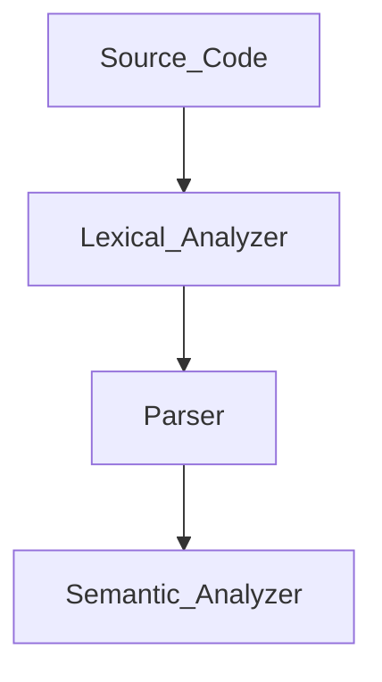

# CCS358 - Principles of Programming Languages

---

<br><br>


# ✅ UNIT I: **SYNTAX AND SEMANTICS**


## 1️⃣ **Evolution of Programming Languages**

**diagram: false**

### 🧬 From 0s to Python:

| Generation | Language Type             | Example      | What It Did                 |
| ---------- | ------------------------- | ------------ | --------------------------- |
| 1st Gen    | Machine Language (Binary) | 101010       | Direct to hardware          |
| 2nd Gen    | Assembly Language         | `MOV AX, BX` | Mnemonics instead of binary |
| 3rd Gen    | High-Level                | C, Java      | Human-readable, compiled    |
| 4th Gen    | Declarative               | SQL, MATLAB  | Tell *what* to do, not how  |
| 5th Gen    | AI/Logic-based            | Prolog, LISP | Based on logic & inference  |

🧠 **Why It Matters:**

* Makes programming **easier**, **faster**, and **more powerful**
* Each gen solved problems the previous one couldn’t

---

## 2️⃣ **Describing Syntax**

**diagram: false**

* Syntax = **Structure** or *grammar rules* of a language
* Example: `int x = 10;` ✔️ but `int = x 10;` ❌

### 📌 Tools to Describe Syntax:

* **BNF (Backus-Naur Form)**: Uses symbols like `::=`, `|` to write grammar rules
* **EBNF**: Extended version of BNF
* **Syntax Trees**: Visual way to show how a sentence conforms to grammar

---

## 3️⃣ **Context-Free Grammars (CFGs)**

**diagram: true**
**Google:** `context free grammar example parse tree`

### 🎯 Used for:

* Defining programming language rules
* Building **parsers**

### 🧱 CFG Components:

* **Terminals**: actual symbols (e.g., `a`, `b`, `id`)
* **Non-terminals**: variables representing grammar rules (e.g., `S`, `A`, `Expr`)
* **Productions**: Rules like `S → aA`
* **Start symbol**: The root non-terminal (usually `S`)

### 🧪 Example:

```
S → aA  
A → bB  
B → c
```

This generates: `abc` ✅

---

## 4️⃣ **Attribute Grammars**

**diagram: false**

Adds **semantics** to CFG by attaching **attributes** to grammar symbols.

### 🎯 Used for:

* Type checking
* Code generation
* Symbol table management

### ✨ Types:

* **Synthesized Attributes**: Info passed up (child → parent)
* **Inherited Attributes**: Info passed down (parent → child)

---

## 5️⃣ **Describing Semantics**

**diagram: false**

Semantics = What the code **means**, beyond just being *correct* syntax.

### 🔍 3 Types of Semantics:

| Type             | Meaning                                                            |
| ---------------- | ------------------------------------------------------------------ |
| **Operational**  | Step-by-step execution meaning                                     |
| **Denotational** | Math function for every construct                                  |
| **Axiomatic**    | Logic-based reasoning using pre/post conditions (like Hoare logic) |

### 📌 Example:

For statement: `x := x + 1`, semantics = *increase x by 1*

---

## 6️⃣ **Lexical Analysis**

**diagram: true**
**Google:** `lexical analysis phase of compiler diagram`

### 🧠 What It Does:

* Breaks source code into **tokens** (keywords, identifiers, symbols)
* Removes spaces, comments
* Detects **invalid identifiers**

### 🧱 Example:

Code: `int x = 5;`
Tokens: `int`, `id(x)`, `=`, `num(5)`, `;`

### Tools Used:

* **Finite Automata**
* **Regular expressions**

---

## 7️⃣ **Parsing**

**diagram: true**
**Google:** `parse tree vs syntax tree`

### 🧠 What It Does:

* Takes tokens and checks if they fit the grammar
* Builds **parse tree / syntax tree**
* Detects **syntax errors**

### 🛠️ Two Parsing Types:

| Type          | Examples                      |
| ------------- | ----------------------------- |
| **Top-Down**  | Predictive, Recursive Descent |
| **Bottom-Up** | Shift-Reduce, LR Parsers      |

---

## 8️⃣ **Recursive-Descent Parsing**

**diagram: true**
**Google:** `recursive descent parser diagram`

* **Top-down** method: Each grammar rule = a recursive function
* Used for LL(1) grammars (1 lookahead)
* Doesn’t work with **left recursion**

### Example:

```
E → T E'  
E' → + T E' | ε  
T → id
```

Code-like structure:

```c
void E() {
  T(); Eprime();
}
```

---

## 9️⃣ **Bottom-Up Parsing**

**diagram: true**
**Google:** `shift reduce parser diagram`

* **Starts from input** and reduces to the start symbol
* Uses **Shift-Reduce** approach
* Can handle **left recursion**

### 🛠️ Key Operations:

| Operation  | Description                   |
| ---------- | ----------------------------- |
| **Shift**  | Push token to stack           |
| **Reduce** | Apply rule to stack items     |
| **Accept** | Input reduced to start symbol |
| **Error**  | Input can't be parsed         |

Types:

* LR(0)
* SLR(1)
* LALR(1)
* CLR(1)

---

## 🔁 Full Flow of Compilation (Simplified):

**diagram: true**
**Google:** `compiler phases diagram`



---

<br><br>


# ✅ **UNIT II – DATA, DATA TYPES, AND BASIC STATEMENTS**


---

## 🔤 **1. Names**

* **Identifiers** used for variables, functions, arrays, classes, etc.
* Names connect the programmer’s code to memory locations or values.
* Must follow the language’s naming rules (e.g., no spaces, can't start with digits).
* Internally represented in a **symbol table** during compilation.

---

## 📦 **2. Variables**

* **Abstraction** of a memory location that stores a value.
* Has three properties:

  * **Name** (identifier)
  * **Address** (memory location)
  * **Value** (data stored)
* Can be **mutable** (can change) or **immutable** (fixed after assignment).

---

## 🔗 **3. Binding**

> *Binding = connection*

* It’s the **association** between a variable and its attributes (like type, memory address, etc.).
* **Static binding**: Done at compile time (e.g., C/C++)
* **Dynamic binding**: Done at runtime (e.g., Python)
* **Early binding** = better performance
  **Late binding** = more flexibility

---

## ✅ **4. Type Checking**

* Ensures that **operations are performed between compatible types**
* Types prevent logic errors (e.g., adding a string to an integer)
* **Static type checking**: At compile time (C, Java)
* **Dynamic type checking**: At runtime (Python, JS)

---

## 🌐 **5. Scope**

* **Scope = where a variable is accessible**
* **Local scope**: Declared inside functions or blocks
* **Global scope**: Declared outside functions; available everywhere
* Avoid **naming conflicts** and control visibility.

---

## 🧾 **6. Scope Rules**

* Defines how scopes are nested and resolved.
* **Static (lexical) scope**: Based on program text (most common)
* **Dynamic scope**: Based on the call stack at runtime (rare)
* Helps determine **which variable** to use when names overlap.

---

## 🕓 **7. Lifetime & Garbage Collection**

* **Lifetime**: Time from variable creation → destruction.
* **Static lifetime**: Exists for entire program run
* **Stack-dynamic**: Created when function is called; destroyed when it ends
* **Garbage collection**: Automatic memory clean-up (used in Java, Python)

  * Prevents **memory leaks**

---

## 🔢 **8. Primitive Data Types**

* **Basic building blocks** of all other types.
* Common primitives:

  * Integer (`int`)
  * Floating-point (`float`, `double`)
  * Boolean (`true/false`)
  * Character (`char`)
* Supported by almost all programming languages.

---

## 🧵 **9. Strings**

* **Sequence of characters**
* Immutable in many languages (e.g., Java, Python)
* May have built-in operators like concatenation (`+`), slicing, length functions.

---

## 🧱 **10. Array Types**

* **Fixed-size**, indexed collection of elements (same type)
* Indexing usually starts at 0
* Static (fixed size) or dynamic (can resize)

---

## 🔎 **11. Associative Arrays**

* Also known as **maps** or **dictionaries**
* Stores **key-value pairs**
* Keys can be strings, numbers, etc.
* Example in Python:

  ```python
  student = {"name": "Alex", "age": 20}
  ```

---

## 📚 **12. Record Types**

* Collection of **different data types** grouped together
* Like a **struct in C**, or an object without behavior
* Used to represent real-world entities (e.g., student with name, ID, GPA)
* Similar to classes, but **no methods**

---

## 🧪 **13. Union Types**

* **Multiple types share the same memory**
* At any time, only **one** of the fields holds a value
* Saves memory, but you must track what's active manually

---

## 📍 **14. Pointers and References**

* **Pointers**: Store memory addresses (C/C++)
* **References**: Another name for a variable (e.g., C++, Java references)
* Pointers allow **indirect access** to memory
* Powerful but **can cause errors** if misused

---

## ➕ **15. Arithmetic Expressions**

* Combine variables, constants, and operators like `+`, `-`, `*`, `/`
* Must follow **operator precedence**
* Evaluated left to right or based on brackets

---

## ➕➕ **16. Overloaded Operators**

* **Same operator** behaves differently depending on the context
* Example:

  * `+` for numbers → addition
  * `+` for strings → concatenation
* Common in **C++, Python, Java**

---

## 🔄 **17. Type Conversions**

* Converting one type to another (e.g., `int` to `float`)
* **Implicit**: Done automatically (promotion)
* **Explicit**: Manual casting by programmer

---

## 🧠 **18. Relational & Boolean Expressions**

* **Relational**: Compare values → `==`, `!=`, `<`, `>`, etc.
* **Boolean**: Combine comparisons → `&&`, `||`, `!`
* Used in decision-making
* Yes, `||` is logical OR (✅)

---

## 🧮 **19. Assignment Statements**

* Used to **store a value in a variable**
* Example: `x = 10;`
* Can be **simple** or **chained** (`x = y = z = 5;`)

---

## ⚙️ **20. Mixed Mode Assignments**

* Assigning value of one type to variable of another
* e.g., `int x = 10.5;` — implicit conversion happens (10.5 → 10)

---

## 🔀 **21. Control Structures**

Used to **control the flow** of program execution:

* **Selection**: `if`, `if-else`, `switch`
* **Iteration**: `for`, `while`, `do-while`
* **Branching**: `break`, `continue`, `goto`
* **Guarded Statements** (for advanced and concurrent flow)

---

## ✅ **22. Selection**

* Choosing between two or more paths:

  * `if (condition)`
  * `if-else`
  * `switch-case`

---

## 🔁 **23. Iteration**

* Repeating a block of code:

  * `for` → known number of times
  * `while` → until condition false
  * `do-while` → at least once

---

## 🚨 **24. Branching**

* Change the flow inside loops:

  * `break` → exits loop
  * `continue` → skips to next iteration
  * `goto` → jumps to a labeled statement (use with care)

---

## 🛡️ **25. Guarded Statements**

* Advanced conditional structure with multiple guarded options
* Guards = boolean conditions
* Executes **only one** whose guard is true, sometimes **nondeterministically**
* Example (pseudo):

  ```text
  if
    [x > 0] -> y = 1
  [] [x == 0] -> y = 0
  fi
  ```

---

<br><br>

# ✅ UNIT III – SUBPROGRAMS AND IMPLEMENTATIONS
---

## 🌟 Subprograms

* A **subprogram** is a reusable block of code designed to perform a specific task.
* Types:

  * **Functions**: return a value (e.g., `int add(int a, int b)`)
  * **Procedures**: perform an action but do **not** return a value (common in languages like Pascal)
* Helps in:

  * Reducing redundancy
  * Improving modularity and readability
  * Allowing recursive logic

---

## 🧩 Design Issues of Subprograms

Important design questions while creating or analyzing subprograms:

* How are **parameters** passed?
* Are **local variables** static or dynamic?
* Can subprograms be **overloaded** or **generic**?
* Can they be **nested** inside other subprograms?
* Are **side effects** (like modifying global variables) allowed?

---

## 🧠 Local Referencing Environments

* Refers to what variables are **accessible** inside the subprogram.
* Includes:

  * **Formal parameters**
  * **Locally declared variables**
  * **Non-local variables** (based on scoping rules)
* Depends on whether the language supports **static** or **dynamic scoping** (more on this later).

---

## 📤 Parameter Passing Mechanisms

**diagram: true**
Search: `parameter passing mechanisms diagram`

Different ways arguments are passed into subprograms:

* **Pass-by-Value**: Copies value. No effect on original.
* **Pass-by-Reference**: Passes memory address. Changes reflect outside.
* **Pass-by-Result**: Final value is copied back to caller.
* **Pass-by-Value-Result**: Combination of value and result.
* **Pass-by-Name**: Like macro. Expression is re-evaluated every time.

Example:

```cpp
void update(int& x) { x = x + 10; }
```

* Here, `&x` means pass-by-reference.

---

## 🧠 Overloaded Methods

* Methods/functions with the **same name** but **different parameter types or counts**.
* Resolved at **compile time** (static polymorphism).

Example:

```cpp
int area(int side);
float area(float radius);
```

---

## 👥 Generic Methods

* Functions designed to work with **any data type**.
* Improves **reusability** and **type safety**.

Example in C++:

```cpp
template <typename T>
T max(T a, T b) {
    return (a > b) ? a : b;
}
```

* Here, `T` can be any type (int, float, etc.)

---

## ⚙️ Design Issues for Functions

While designing functions, consider:

* Can the function return **more than one value**?
* Are **side effects** allowed?
* Are there **default or optional parameters**?
* What **types** can be returned?

Well-designed functions:

* Have clear input and output
* Avoid hidden side effects
* Use meaningful names and pure logic (if possible)

---

## 🔁 Semantics of Call and Return

**diagram: true**
Search: `activation record function call diagram`

* When a function is **called**:

  * A **new activation record (stack frame)** is pushed onto the call stack.
  * It contains return address, parameters, local variables, etc.
* When a function **returns**:

  * The activation record is popped
  * Control jumps back to the return address

---

## 🧱 Implementing Simple Subprograms

* Done using **stack-based memory allocation**:

  * Every call gets a new **activation record**.
  * It contains local variables, return address, and parameters.
* Easy to implement and fast.
* Most languages use a **runtime stack** to manage function calls.

---

## 🗂️ Stack and Dynamic Local Variables

* **Stack-based locals**:

  * Automatically allocated and destroyed.
  * Exist only during subprogram execution.
* **Dynamic locals** (heap-based):

  * Exist beyond function calls
  * Must be explicitly managed (`malloc/free` or `new/delete`)

---

## 🪆 Nested Subprograms

**diagram: true**
Search: `nested subprograms with static link diagram`

* Subprograms defined **within** another subprogram.
* Useful for:

  * Encapsulation
  * Creating helper methods with limited visibility
* Needs a **static link** to access enclosing scope's variables.

Example:

```python
def outer():
    x = 10
    def inner():
        print(x)
    inner()
```

---

## 📦 Blocks

* A **block** is a group of statements enclosed in `{ }` or `begin...end`
* Not a full subprogram but can have its own **scope**
* Used in loops, conditions, exception handling

Example:

```cpp
if (x > 0) {
    int y = x * 2;
    cout << y;
}
```

---

## 🧠 Dynamic Scoping

**diagram: true**
Search: `static vs dynamic scoping diagram`

* Variable bindings are determined **at runtime** based on **calling function**
* Unlike static scoping, where you look at the code structure

Example:

```bash
x=5
foo() { echo $x; }
bar() {
    local x=10
    foo  # prints 10 in dynamic scoping
}
```

* Rare in modern languages, but still relevant in scripting (like Bash)

---

<br><br>


# ✅ UNIT IV – OBJECT-ORIENTATION, CONCURRENCY & EVENT HANDLING

**diagram: true**
**Google These**

* `object oriented programming diagram with class object inheritance`
* `semaphore vs monitor in operating system diagram`
* `event handling flowchart programming`

---

## 1️⃣ Object-Orientation (OOP)

OOP is a paradigm built on the idea of **objects**—which are bundles of **data (attributes)** and **code (methods)**.

### Core Pillars of OOP:

* **Class:** Blueprint/Template. E.g., `class Animal`
* **Object:** Instance of a class. E.g., `dog = Animal()`
* **Encapsulation:** Wrap data + methods into one unit. Controls access with modifiers like `private`, `public`.
* **Inheritance:** Reuse code from parent class. E.g., `class Dog extends Animal`
* **Polymorphism:** Same method name behaves differently.
  ➤ `speak()` could mean "bark", "meow", etc., depending on object.
* **Abstraction:** Hides complex details. You call `.save()` without knowing what’s happening inside.

🧠 **Real-Life Analogy:**
Car = Object
Car blueprint = Class
Driving = Method
Engine = Encapsulated Data

---

## 2️⃣ Design Issues for OOP Languages

While building an OOP language (like Java, C++), designers must decide:

* **How to manage visibility?** → `private`, `protected`, `public`
* **How to implement inheritance?** → Single? Multiple? Interface-based?
* **Should constructors/destructors exist?**
  → For object creation and clean-up
* **Support for polymorphism?** → Static (compile time) or Dynamic (run time)?
* **Method Overloading Rules** → Can we have multiple `print()`s with different parameters?

These design choices **affect how code behaves, runs, and is understood**.

---

## 3️⃣ Implementation of OOP Constructs

This is where theory hits memory and the compiler cries.

| Feature              | Behind the scenes magic                                              |
| -------------------- | -------------------------------------------------------------------- |
| **Objects**          | Stored in heap. Have fields and pointers to methods.                 |
| **Methods**          | Looked up via **V-Table** (Virtual Table) if polymorphic.            |
| **Inheritance**      | Child class layout includes parent’s attributes + new stuff.         |
| **Dynamic Dispatch** | Used to choose correct overridden method at runtime.                 |
| **Encapsulation**    | Achieved by storing access control flags + restricted method access. |

> TL;DR: Every object has a footprint in memory, and compilers use tables & pointers to resolve class hierarchies and method calls.

---

## 4️⃣ Concurrency

Concurrency = **Multiple tasks running in overlapping time**. Not always *at the same time* (parallel), but overlapping.

🔧 Example:
While loading a webpage, you can scroll and type—those are concurrent activities.

Used in:

* Multi-threaded programs
* Operating systems
* Games and UI apps

---

## 5️⃣ Semaphores

**Semaphore** = A counter that helps manage access to **shared resources**.
Used to avoid race conditions (2+ tasks accessing same resource).

### Types:

* **Binary Semaphore:** Only 0 or 1. Acts like a lock.
* **Counting Semaphore:** Allows multiple accesses, based on a limit.

### Two operations:

* `wait()` or `P()` – Decrement the semaphore
* `signal()` or `V()` – Increment it

🧠 Think of it as a traffic light for threads.

---

## 6️⃣ Monitors

Monitors = Advanced synchronization tools.
They combine:

* Shared data
* Operations on that data
* Automatic locking mechanism 🔐

💡 Only one thread can execute inside a monitor at a time.
They’re safer and easier to use than raw semaphores.

Used in high-level languages like Java:

```java
synchronized void increment() {
   counter++;
}
```

---

## 7️⃣ Message Passing

When threads/processes can’t safely share memory → they **pass messages**.

Used in:

* Distributed systems 🌍
* Actor model languages (e.g., Erlang, Go, Akka)

### Key idea:

Instead of threads fighting over memory, they **send each other data** safely.

```python
# Example (Python-like pseudocode)
process1.send("hello")
msg = process2.receive()
```

Benefits:

* Safe
* Scalable
* Great for cloud and parallel computing ☁️⚙️

---

## 8️⃣ Threads

A **thread** is like a mini-process that runs inside a bigger process.
They share memory but run independently.

### Why threads?

* Faster than full-blown processes
* Perfect for background tasks (e.g., downloading a file, loading UI, etc.)

Example:

```java
Thread t = new Thread(() -> {
   System.out.println("I run parallelly!");
});
t.start();
```

👾 Multi-threading helps make apps faster & more responsive, but too many threads can cause chaos (deadlocks, race conditions).

---

## 9️⃣ Statement-Level Concurrency

This is the compiler’s job—**auto-parallelizing** independent statements.

Example:

```c
a = b + c;
d = e + f;
```

These can be computed in parallel since there’s no dependency between them.
Used in:

* Scientific computing
* Compilers for optimization
* SIMD (Single Instruction Multiple Data) architecture

---

## 🔥 10. Exception Handling

When your code blows up, you don’t want the app to die.

### Exception Handling helps:

* Catch errors
* Handle them gracefully
* Continue or shut down cleanly

Example in Java:

```java
try {
  int x = 1 / 0;
} catch (ArithmeticException e) {
  System.out.println("Oops, can't divide by zero.");
}
```

Types:

* **Checked** (must handle)
* **Unchecked** (runtime errors)

Languages like Java, Python, C++ all support exception handling in some form.

---

## 🛎️ 11. Event Handling

**Events** = Signals that something has happened
(e.g., mouse click, button pressed, key typed)

### Used in:

* GUI apps
* Web apps (e.g., `onClick`)
* Real-time systems

How it works:

1. **Event Source:** The object that triggers an event (e.g., button)
2. **Event Listener:** Watches for the event
3. **Event Handler:** Code that responds to it

💡 In JS:

```js
button.addEventListener("click", () => {
   alert("Clicked!");
});
```

Modern apps are **event-driven**—code responds to actions instead of running linearly.

---

<br><br>


## 📚 UNIT V – Functional and Logic Programming Languages


### 🔹 1. **Lambda Calculus – The Foundation of Functional Programming**

* It’s a **mathematical model** used to define computation with functions
* Introduced by **Alonzo Church**
* Everything is based on **functions**, **function calls**, and **variable binding**

**Basic Syntax:**

```lambda
λx.x      → Identity function  
λx.λy.x+y → Adds two numbers
```

**Use in modern languages**: Underlies how **functional languages** and **anonymous functions** work
e.g., Python, JavaScript, Haskell all secretly love lambda ❤

📝 *Google:* `lambda calculus simple examples`

---

### 🔹 2. **Fundamentals of Functional Programming Languages**

Functional programming is like treating your code like math equations – **no changing stuff**, just pure functions.

**Core Concepts:**

* **Pure Functions** → No side effects
* **Immutability** → Variables can’t be changed
* **First-class Functions** → Functions = variables
* **Higher-order Functions** → Functions that take/return other functions
* **Recursion** > Loops

**Example in Python:**

```python
square = lambda x: x * x
print(square(5))  # Output: 25
```

---

### 🔹 3. **Programming with Scheme**

* Scheme is a **minimal, clean** functional programming language
* A **dialect of Lisp** – looks weird at first but very powerful

**Key Points:**

* Everything is in **prefix notation** `(operator operand1 operand2...)`
* Supports **recursion**, **higher-order functions**
* Used in teaching and AI

**Example:**

```scheme
(define (square x) (* x x))
(square 5) ; Output: 25
```

📝 *Google:* `scheme programming examples basic`

---

### 🔹 4. **Programming with ML (Meta Language)**

* A **functional language** used in research, AI, and compilers
* Known for:

  * **Strong static typing**
  * **Pattern matching**
  * **Immutability**

**Example (in Standard ML):**

```ml
fun square x = x * x;
square 4; (* Output: 16 *)
```

📝 *Google:* `ML functional language example`

---

### 🔹 5. **Introduction to Logic and Logic Programming**

Logic programming = “Declare facts, rules, and let the system figure it out” 🔍

**Features:**

* Based on **formal logic**
* Uses **facts** (true statements), **rules**, and **queries**
* The engine **infers results**

---

### 🔹 6. **Programming with Prolog**

Prolog = OG logic programming language

**Program =**

* **Facts**: parent(john, sam).
* **Rules**: grandparent(X, Y) :- parent(X, Z), parent(Z, Y).
* **Query**: ?- grandparent(john, X).

**Use cases**:

* AI
* Natural language processing
* Expert systems

📝 *Google:* `prolog logic programming examples`

---

### 🔹 7. **Multi-Paradigm Languages**

These are languages that **mix multiple styles**: OOP, functional, logic, procedural

| Language   | Paradigms Supported                           |
| ---------- | --------------------------------------------- |
| Python 🐍  | OOP, Functional, Procedural, Logic (via libs) |
| JavaScript | Functional, Event-driven, OOP                 |
| Scala      | OOP + Functional                              |
| C++        | Procedural + OOP + Generic                    |
| Rust 🦀    | Functional + Systems Programming              |

**Example in Python:**

```python
# Functional
double = lambda x: x * 2

# OOP
class Dog:
    def bark(self): print("Woof!")
```

---

## 🧾 Exam-Ready Summary 💯

> Unit 5 focuses on **functional and logic programming paradigms**.
>
> * **Lambda calculus** is the theoretical foundation of functional languages.
> * **Functional programming** emphasizes pure functions and immutability.
> * **Languages like Scheme and ML** are used for function-based development.
> * **Logic programming**, seen in **Prolog**, uses facts and rules to infer results.
> * **Multi-paradigm languages** like Python and Scala allow mixing different programming styles for flexibility.

---

# 2 Mark


### **UNIT I – SYNTAX AND SEMANTICS**

1. **What is syntax in a programming language?**
   → Syntax is the set of rules that defines the structure and form of valid statements in a programming language.

2. **Define semantics with an example.**
   → Semantics defines the meaning of syntactically correct programs.
   Example: `x = x + 1;` means increment the value of `x` by 1.

3. **What are the stages of evolution of programming languages?**
   → Machine language → Assembly → Procedural → Object-Oriented → Functional and Logic Languages.

4. **What is the purpose of a context-free grammar?**
   → It defines the syntax rules of programming languages using production rules.

5. **Differentiate between syntax and semantics.**
   → Syntax = structure/form. Semantics = meaning/purpose.

6. **What is a terminal and non-terminal in CFG?**
   → Terminals are actual symbols (e.g., `a`, `b`); Non-terminals are placeholders (e.g., `S`, `A`).

7. **Define attribute grammar.**
   → An extension of CFG that uses attributes to provide additional semantic info.

8. **What is lexical analysis?**
   → It's the first phase of a compiler that breaks code into tokens.

9. **Mention any two tasks of a lexical analyzer.**
   → Token generation, removing white spaces/comments.

10. **Define parsing.**
    → Parsing checks if the token sequence follows the grammar rules.

11. **What is recursive-descent parsing?**
    → A top-down parser where each non-terminal is implemented by a recursive function.

12. **What is bottom-up parsing?**
    → It constructs the parse tree from leaves to root using shift-reduce operations.

13. **List any two examples of programming language syntax rules.**
    → (1) Semicolon at the end of a statement.
    (2) Parentheses for function calls.

14. **What does a parse tree represent?**
    → It represents the syntactic structure of a string according to a grammar.

15. **What is ambiguity in grammar?**
    → A grammar is ambiguous if a sentence can have more than one parse tree.

---

### **UNIT II – DATA, DATA TYPES, AND BASIC STATEMENTS**

1. **Define a variable.**
   → A variable is a named memory location used to store data.

2. **What is the difference between name and variable?**
   → A name is an identifier; a variable is the storage associated with that name.

3. **What is binding in programming?**
   → Binding is the association between variables and values, types, or storage.

4. **Define static type checking.**
   → Checking types at compile-time to detect type errors.

5. **What is scope?**
   → Scope defines the part of the program where a variable can be accessed.

6. **Distinguish between static and dynamic scope.**
   → Static scope: Based on program structure.
   Dynamic scope: Based on call stack at runtime.

7. **Define lifetime of a variable.**
   → The time during which the variable exists in memory.

8. **What is garbage collection?**
   → Automatic memory management that frees memory occupied by unused objects.

9. **List any two primitive data types.**
   → Integer, Float.

10. **What is an associative array?**
    → A collection of key-value pairs, like a dictionary or map.

11. **Define record type with an example.**
    → A record is a collection of related fields.
    Example: `struct Student { int id; char name[20]; };`

12. **What is a union type?**
    → A variable that can store different data types but only one at a time.

13. **Differentiate between pointer and reference.**
    → Pointer stores memory address explicitly; reference is an alias for another variable.

14. **What is an arithmetic expression?**
    → A combination of operands and operators like `a + b * c`.

15. **What is a mixed-mode assignment?**
    → Assigning values of different data types in a single expression, like `int x = 5.7;`.

---

### **UNIT III – SUBPROGRAMS AND IMPLEMENTATIONS**

1. **What is a subprogram?**
   → A reusable block of code that performs a specific task (e.g., functions, procedures).

2. **Define parameter passing.**
   → The process of providing input values to a subprogram.

3. **Differentiate between actual and formal parameters.**
   → Actual: real values passed. Formal: placeholders in subprogram.

4. **What is local referencing environment?**
   → It defines the scope and visibility of variables inside a subprogram.

5. **Define overloaded method.**
   → A method with the same name but different parameters.

6. **What are generic methods?**
   → Methods that work with different data types using type parameters.

7. **Mention any two design issues in functions.**
   → Parameter passing method, return values.

8. **What is the semantic meaning of a call statement?**
   → It transfers control to the subprogram and begins execution.

9. **What is the purpose of a return statement?**
   → To send back a value and control to the calling code.

10. **Define stack-dynamic local variable.**
    → A variable created at runtime when the subprogram is called.

11. **What is a nested subprogram?**
    → A function defined inside another function.

12. **What is a block in programming?**
    → A group of statements enclosed in `{}` or `begin-end`.

13. **Define dynamic scoping.**
    → Variable resolution based on the call sequence, not the program structure.

14. **What are default parameters in subprograms?**
    → Parameters with predefined values if no value is passed.

15. **What is a subprogram protocol?**
    → The interface that includes the name, parameter list, and return type.

---

### **UNIT IV – OBJECT-ORIENTATION, CONCURRENCY, AND EVENT HANDLING**

1. **What are the basic principles of object-oriented programming?**
   → Encapsulation, Inheritance, Polymorphism, Abstraction.

2. **Define inheritance.**
   → A mechanism where a class inherits properties of another class.

3. **What is encapsulation?**
   → Hiding internal details and exposing only essential features.

4. **Mention any two design issues in OOP languages.**
   → Object allocation/deallocation and inheritance type (single/multiple).

5. **What is method overriding?**
   → Redefining a base class method in a derived class.

6. **Define constructor and destructor.**
   → Constructor: Initializes objects.
   Destructor: Cleans up when an object is destroyed.

7. **What is concurrency?**
   → Execution of multiple threads or processes at the same time.

8. **Define semaphore.**
   → A variable used for controlling access to a common resource in concurrent systems.

9. **What is a monitor in concurrency?**
   → A synchronization construct that allows safe access to shared resources.

10. **What is message passing?**
    → A method where processes communicate by sending and receiving messages.

11. **Define a thread.**
    → A lightweight process or unit of execution within a program.

12. **What is statement-level concurrency?**
    → Multiple statements executing simultaneously.

13. **What is exception handling?**
    → A mechanism to handle runtime errors.

14. **What is an event in event-driven programming?**
    → An action like a mouse click or key press that triggers code execution.

15. **What is the difference between process and thread?**
    → Process: Independent execution.
    Thread: Lightweight, shares memory with other threads in the same process.

---

### **UNIT V – FUNCTIONAL AND LOGIC PROGRAMMING LANGUAGES**

1. **What is lambda calculus?**
   → A formal system for expressing computation using functions.

2. **Define a lambda expression.**
   → An anonymous function like `(x) => x + 1`.

3. **Mention any two features of functional programming.**
   → No side effects, functions as first-class citizens.

4. **What is recursion in functional programming?**
   → A function calling itself to solve a smaller subproblem.

5. **Define referential transparency.**
   → An expression can be replaced with its value without changing behavior.

6. **What is Scheme?**
   → A minimalist functional programming language based on Lisp.

7. **What is ML in functional programming?**
   → A statically typed functional language with type inference.

8. **Mention one difference between Scheme and ML.**
   → Scheme is dynamically typed; ML is statically typed.

9. **What is logic programming?**
   → Programming using formal logic to express facts and rules.

10. **What is a proposition in symbolic logic?**
    → A statement that can be either true or false.

11. **What is Prolog?**
    → A logic programming language used in AI and symbolic reasoning.

12. **Define backtracking in logic programming.**
    → Trying alternative solutions when the current one fails.

13. **What is a fact and a rule in Prolog?**
    → Fact: Known truth. Rule: Condition-based inference.

14. **What are multi-paradigm languages?**
    → Languages that support more than one programming paradigm.

15. **Give an example of a logic programming language.**
    → Prolog.

---

