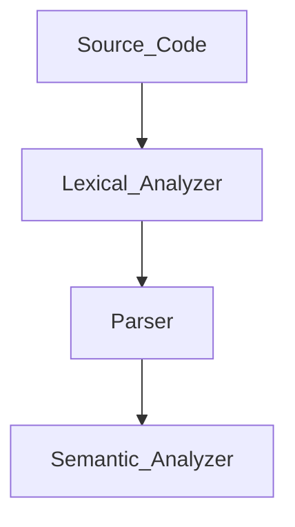

# CCS358 - Principles of Programming Languages

---

<br><br>


# ✅ UNIT I: **SYNTAX AND SEMANTICS**


## 1️⃣ **Evolution of Programming Languages**

**diagram: false**

### 🧬 From 0s to Python:

| Generation | Language Type             | Example      | What It Did                 |
| ---------- | ------------------------- | ------------ | --------------------------- |
| 1st Gen    | Machine Language (Binary) | 101010       | Direct to hardware          |
| 2nd Gen    | Assembly Language         | `MOV AX, BX` | Mnemonics instead of binary |
| 3rd Gen    | High-Level                | C, Java      | Human-readable, compiled    |
| 4th Gen    | Declarative               | SQL, MATLAB  | Tell *what* to do, not how  |
| 5th Gen    | AI/Logic-based            | Prolog, LISP | Based on logic & inference  |

🧠 **Why It Matters:**

* Makes programming **easier**, **faster**, and **more powerful**
* Each gen solved problems the previous one couldn’t

---

## 2️⃣ **Describing Syntax**

**diagram: false**

* Syntax = **Structure** or *grammar rules* of a language
* Example: `int x = 10;` ✔️ but `int = x 10;` ❌

### 📌 Tools to Describe Syntax:

* **BNF (Backus-Naur Form)**: Uses symbols like `::=`, `|` to write grammar rules
* **EBNF**: Extended version of BNF
* **Syntax Trees**: Visual way to show how a sentence conforms to grammar

---

## 3️⃣ **Context-Free Grammars (CFGs)**

**diagram: true**
**Google:** `context free grammar example parse tree`

### 🎯 Used for:

* Defining programming language rules
* Building **parsers**

### 🧱 CFG Components:

* **Terminals**: actual symbols (e.g., `a`, `b`, `id`)
* **Non-terminals**: variables representing grammar rules (e.g., `S`, `A`, `Expr`)
* **Productions**: Rules like `S → aA`
* **Start symbol**: The root non-terminal (usually `S`)

### 🧪 Example:

```
S → aA  
A → bB  
B → c
```

This generates: `abc` ✅

---

## 4️⃣ **Attribute Grammars**

**diagram: false**

Adds **semantics** to CFG by attaching **attributes** to grammar symbols.

### 🎯 Used for:

* Type checking
* Code generation
* Symbol table management

### ✨ Types:

* **Synthesized Attributes**: Info passed up (child → parent)
* **Inherited Attributes**: Info passed down (parent → child)

---

## 5️⃣ **Describing Semantics**

**diagram: false**

Semantics = What the code **means**, beyond just being *correct* syntax.

### 🔍 3 Types of Semantics:

| Type             | Meaning                                                            |
| ---------------- | ------------------------------------------------------------------ |
| **Operational**  | Step-by-step execution meaning                                     |
| **Denotational** | Math function for every construct                                  |
| **Axiomatic**    | Logic-based reasoning using pre/post conditions (like Hoare logic) |

### 📌 Example:

For statement: `x := x + 1`, semantics = *increase x by 1*

---

## 6️⃣ **Lexical Analysis**

**diagram: true**
**Google:** `lexical analysis phase of compiler diagram`

### 🧠 What It Does:

* Breaks source code into **tokens** (keywords, identifiers, symbols)
* Removes spaces, comments
* Detects **invalid identifiers**

### 🧱 Example:

Code: `int x = 5;`
Tokens: `int`, `id(x)`, `=`, `num(5)`, `;`

### Tools Used:

* **Finite Automata**
* **Regular expressions**

---

## 7️⃣ **Parsing**

**diagram: true**
**Google:** `parse tree vs syntax tree`

### 🧠 What It Does:

* Takes tokens and checks if they fit the grammar
* Builds **parse tree / syntax tree**
* Detects **syntax errors**

### 🛠️ Two Parsing Types:

| Type          | Examples                      |
| ------------- | ----------------------------- |
| **Top-Down**  | Predictive, Recursive Descent |
| **Bottom-Up** | Shift-Reduce, LR Parsers      |

---

## 8️⃣ **Recursive-Descent Parsing**

**diagram: true**
**Google:** `recursive descent parser diagram`

* **Top-down** method: Each grammar rule = a recursive function
* Used for LL(1) grammars (1 lookahead)
* Doesn’t work with **left recursion**

### Example:

```
E → T E'  
E' → + T E' | ε  
T → id
```

Code-like structure:

```c
void E() {
  T(); Eprime();
}
```

---

## 9️⃣ **Bottom-Up Parsing**

**diagram: true**
**Google:** `shift reduce parser diagram`

* **Starts from input** and reduces to the start symbol
* Uses **Shift-Reduce** approach
* Can handle **left recursion**

### 🛠️ Key Operations:

| Operation  | Description                   |
| ---------- | ----------------------------- |
| **Shift**  | Push token to stack           |
| **Reduce** | Apply rule to stack items     |
| **Accept** | Input reduced to start symbol |
| **Error**  | Input can't be parsed         |

Types:

* LR(0)
* SLR(1)
* LALR(1)
* CLR(1)

---

## 🔁 Full Flow of Compilation (Simplified):

**diagram: true**
**Google:** `compiler phases diagram`



---

<br><br>

