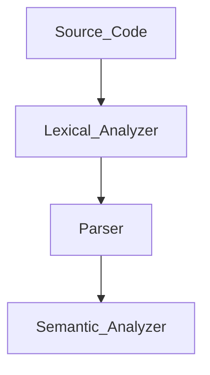

# CCS358 - Principles of Programming Languages

---

<br><br>


# ✅ UNIT I: **SYNTAX AND SEMANTICS**


## 1️⃣ **Evolution of Programming Languages**

**diagram: false**

### 🧬 From 0s to Python:

| Generation | Language Type             | Example      | What It Did                 |
| ---------- | ------------------------- | ------------ | --------------------------- |
| 1st Gen    | Machine Language (Binary) | 101010       | Direct to hardware          |
| 2nd Gen    | Assembly Language         | `MOV AX, BX` | Mnemonics instead of binary |
| 3rd Gen    | High-Level                | C, Java      | Human-readable, compiled    |
| 4th Gen    | Declarative               | SQL, MATLAB  | Tell *what* to do, not how  |
| 5th Gen    | AI/Logic-based            | Prolog, LISP | Based on logic & inference  |

🧠 **Why It Matters:**

* Makes programming **easier**, **faster**, and **more powerful**
* Each gen solved problems the previous one couldn’t

---

## 2️⃣ **Describing Syntax**

**diagram: false**

* Syntax = **Structure** or *grammar rules* of a language
* Example: `int x = 10;` ✔️ but `int = x 10;` ❌

### 📌 Tools to Describe Syntax:

* **BNF (Backus-Naur Form)**: Uses symbols like `::=`, `|` to write grammar rules
* **EBNF**: Extended version of BNF
* **Syntax Trees**: Visual way to show how a sentence conforms to grammar

---

## 3️⃣ **Context-Free Grammars (CFGs)**

**diagram: true**
**Google:** `context free grammar example parse tree`

### 🎯 Used for:

* Defining programming language rules
* Building **parsers**

### 🧱 CFG Components:

* **Terminals**: actual symbols (e.g., `a`, `b`, `id`)
* **Non-terminals**: variables representing grammar rules (e.g., `S`, `A`, `Expr`)
* **Productions**: Rules like `S → aA`
* **Start symbol**: The root non-terminal (usually `S`)

### 🧪 Example:

```
S → aA  
A → bB  
B → c
```

This generates: `abc` ✅

---

## 4️⃣ **Attribute Grammars**

**diagram: false**

Adds **semantics** to CFG by attaching **attributes** to grammar symbols.

### 🎯 Used for:

* Type checking
* Code generation
* Symbol table management

### ✨ Types:

* **Synthesized Attributes**: Info passed up (child → parent)
* **Inherited Attributes**: Info passed down (parent → child)

---

## 5️⃣ **Describing Semantics**

**diagram: false**

Semantics = What the code **means**, beyond just being *correct* syntax.

### 🔍 3 Types of Semantics:

| Type             | Meaning                                                            |
| ---------------- | ------------------------------------------------------------------ |
| **Operational**  | Step-by-step execution meaning                                     |
| **Denotational** | Math function for every construct                                  |
| **Axiomatic**    | Logic-based reasoning using pre/post conditions (like Hoare logic) |

### 📌 Example:

For statement: `x := x + 1`, semantics = *increase x by 1*

---

## 6️⃣ **Lexical Analysis**

**diagram: true**
**Google:** `lexical analysis phase of compiler diagram`

### 🧠 What It Does:

* Breaks source code into **tokens** (keywords, identifiers, symbols)
* Removes spaces, comments
* Detects **invalid identifiers**

### 🧱 Example:

Code: `int x = 5;`
Tokens: `int`, `id(x)`, `=`, `num(5)`, `;`

### Tools Used:

* **Finite Automata**
* **Regular expressions**

---

## 7️⃣ **Parsing**

**diagram: true**
**Google:** `parse tree vs syntax tree`

### 🧠 What It Does:

* Takes tokens and checks if they fit the grammar
* Builds **parse tree / syntax tree**
* Detects **syntax errors**

### 🛠️ Two Parsing Types:

| Type          | Examples                      |
| ------------- | ----------------------------- |
| **Top-Down**  | Predictive, Recursive Descent |
| **Bottom-Up** | Shift-Reduce, LR Parsers      |

---

## 8️⃣ **Recursive-Descent Parsing**

**diagram: true**
**Google:** `recursive descent parser diagram`

* **Top-down** method: Each grammar rule = a recursive function
* Used for LL(1) grammars (1 lookahead)
* Doesn’t work with **left recursion**

### Example:

```
E → T E'  
E' → + T E' | ε  
T → id
```

Code-like structure:

```c
void E() {
  T(); Eprime();
}
```

---

## 9️⃣ **Bottom-Up Parsing**

**diagram: true**
**Google:** `shift reduce parser diagram`

* **Starts from input** and reduces to the start symbol
* Uses **Shift-Reduce** approach
* Can handle **left recursion**

### 🛠️ Key Operations:

| Operation  | Description                   |
| ---------- | ----------------------------- |
| **Shift**  | Push token to stack           |
| **Reduce** | Apply rule to stack items     |
| **Accept** | Input reduced to start symbol |
| **Error**  | Input can't be parsed         |

Types:

* LR(0)
* SLR(1)
* LALR(1)
* CLR(1)

---

## 🔁 Full Flow of Compilation (Simplified):

**diagram: true**
**Google:** `compiler phases diagram`



---

<br><br>


# ✅ **UNIT II – DATA, DATA TYPES, AND BASIC STATEMENTS**


---

## 🔤 **1. Names**

* **Identifiers** used for variables, functions, arrays, classes, etc.
* Names connect the programmer’s code to memory locations or values.
* Must follow the language’s naming rules (e.g., no spaces, can't start with digits).
* Internally represented in a **symbol table** during compilation.

---

## 📦 **2. Variables**

* **Abstraction** of a memory location that stores a value.
* Has three properties:

  * **Name** (identifier)
  * **Address** (memory location)
  * **Value** (data stored)
* Can be **mutable** (can change) or **immutable** (fixed after assignment).

---

## 🔗 **3. Binding**

> *Binding = connection*

* It’s the **association** between a variable and its attributes (like type, memory address, etc.).
* **Static binding**: Done at compile time (e.g., C/C++)
* **Dynamic binding**: Done at runtime (e.g., Python)
* **Early binding** = better performance
  **Late binding** = more flexibility

---

## ✅ **4. Type Checking**

* Ensures that **operations are performed between compatible types**
* Types prevent logic errors (e.g., adding a string to an integer)
* **Static type checking**: At compile time (C, Java)
* **Dynamic type checking**: At runtime (Python, JS)

---

## 🌐 **5. Scope**

* **Scope = where a variable is accessible**
* **Local scope**: Declared inside functions or blocks
* **Global scope**: Declared outside functions; available everywhere
* Avoid **naming conflicts** and control visibility.

---

## 🧾 **6. Scope Rules**

* Defines how scopes are nested and resolved.
* **Static (lexical) scope**: Based on program text (most common)
* **Dynamic scope**: Based on the call stack at runtime (rare)
* Helps determine **which variable** to use when names overlap.

---

## 🕓 **7. Lifetime & Garbage Collection**

* **Lifetime**: Time from variable creation → destruction.
* **Static lifetime**: Exists for entire program run
* **Stack-dynamic**: Created when function is called; destroyed when it ends
* **Garbage collection**: Automatic memory clean-up (used in Java, Python)

  * Prevents **memory leaks**

---

## 🔢 **8. Primitive Data Types**

* **Basic building blocks** of all other types.
* Common primitives:

  * Integer (`int`)
  * Floating-point (`float`, `double`)
  * Boolean (`true/false`)
  * Character (`char`)
* Supported by almost all programming languages.

---

## 🧵 **9. Strings**

* **Sequence of characters**
* Immutable in many languages (e.g., Java, Python)
* May have built-in operators like concatenation (`+`), slicing, length functions.

---

## 🧱 **10. Array Types**

* **Fixed-size**, indexed collection of elements (same type)
* Indexing usually starts at 0
* Static (fixed size) or dynamic (can resize)

---

## 🔎 **11. Associative Arrays**

* Also known as **maps** or **dictionaries**
* Stores **key-value pairs**
* Keys can be strings, numbers, etc.
* Example in Python:

  ```python
  student = {"name": "Alex", "age": 20}
  ```

---

## 📚 **12. Record Types**

* Collection of **different data types** grouped together
* Like a **struct in C**, or an object without behavior
* Used to represent real-world entities (e.g., student with name, ID, GPA)
* Similar to classes, but **no methods**

---

## 🧪 **13. Union Types**

* **Multiple types share the same memory**
* At any time, only **one** of the fields holds a value
* Saves memory, but you must track what's active manually

---

## 📍 **14. Pointers and References**

* **Pointers**: Store memory addresses (C/C++)
* **References**: Another name for a variable (e.g., C++, Java references)
* Pointers allow **indirect access** to memory
* Powerful but **can cause errors** if misused

---

## ➕ **15. Arithmetic Expressions**

* Combine variables, constants, and operators like `+`, `-`, `*`, `/`
* Must follow **operator precedence**
* Evaluated left to right or based on brackets

---

## ➕➕ **16. Overloaded Operators**

* **Same operator** behaves differently depending on the context
* Example:

  * `+` for numbers → addition
  * `+` for strings → concatenation
* Common in **C++, Python, Java**

---

## 🔄 **17. Type Conversions**

* Converting one type to another (e.g., `int` to `float`)
* **Implicit**: Done automatically (promotion)
* **Explicit**: Manual casting by programmer

---

## 🧠 **18. Relational & Boolean Expressions**

* **Relational**: Compare values → `==`, `!=`, `<`, `>`, etc.
* **Boolean**: Combine comparisons → `&&`, `||`, `!`
* Used in decision-making
* Yes, `||` is logical OR (✅)

---

## 🧮 **19. Assignment Statements**

* Used to **store a value in a variable**
* Example: `x = 10;`
* Can be **simple** or **chained** (`x = y = z = 5;`)

---

## ⚙️ **20. Mixed Mode Assignments**

* Assigning value of one type to variable of another
* e.g., `int x = 10.5;` — implicit conversion happens (10.5 → 10)

---

## 🔀 **21. Control Structures**

Used to **control the flow** of program execution:

* **Selection**: `if`, `if-else`, `switch`
* **Iteration**: `for`, `while`, `do-while`
* **Branching**: `break`, `continue`, `goto`
* **Guarded Statements** (for advanced and concurrent flow)

---

## ✅ **22. Selection**

* Choosing between two or more paths:

  * `if (condition)`
  * `if-else`
  * `switch-case`

---

## 🔁 **23. Iteration**

* Repeating a block of code:

  * `for` → known number of times
  * `while` → until condition false
  * `do-while` → at least once

---

## 🚨 **24. Branching**

* Change the flow inside loops:

  * `break` → exits loop
  * `continue` → skips to next iteration
  * `goto` → jumps to a labeled statement (use with care)

---

## 🛡️ **25. Guarded Statements**

* Advanced conditional structure with multiple guarded options
* Guards = boolean conditions
* Executes **only one** whose guard is true, sometimes **nondeterministically**
* Example (pseudo):

  ```text
  if
    [x > 0] -> y = 1
  [] [x == 0] -> y = 0
  fi
  ```

---

<br><br>

test line